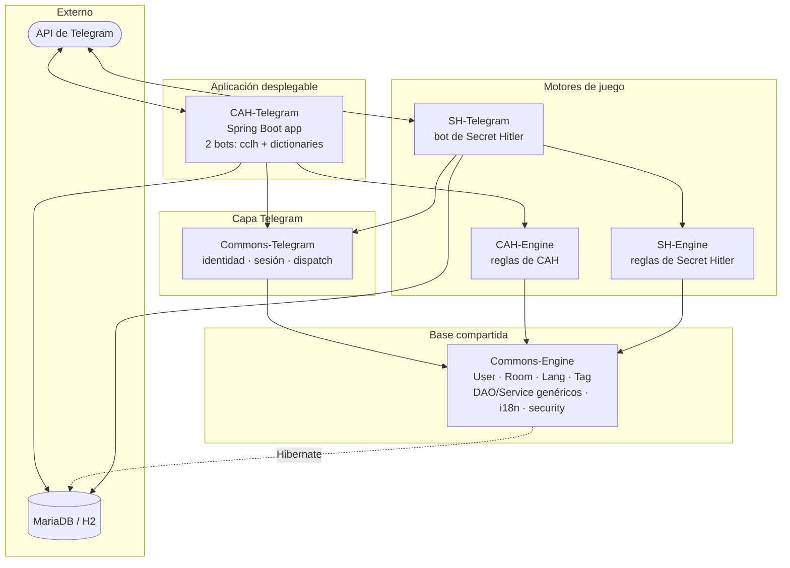
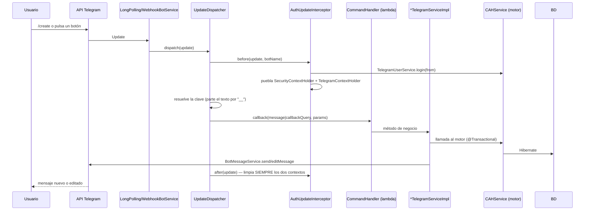
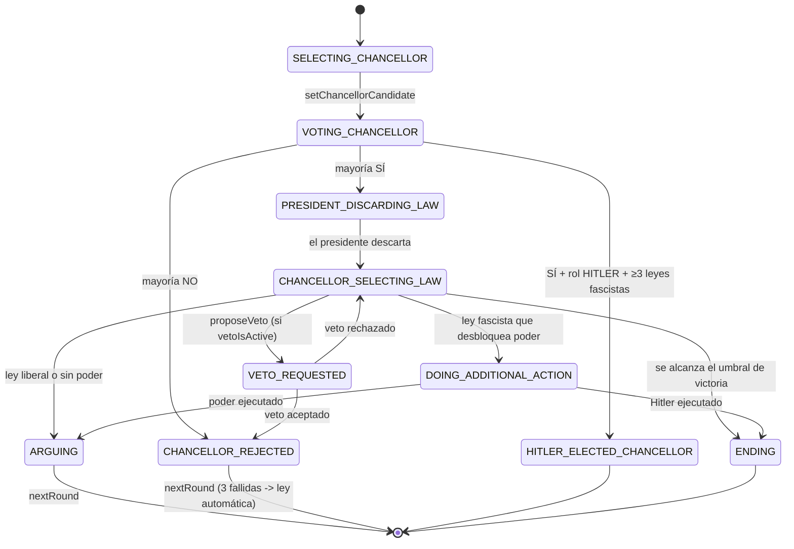

# Codebase Map — CCLH (superproyecto)

> Generado por Cartographer. Última actualización: 2026-08-29.
>
> Este es el mapa **del superproyecto**. Cada submódulo tiene además su propio
> `<Módulo>/docs/CODEBASE_MAP.md` con el detalle fino. Ver
> [§ Mapas por módulo](#mapas-por-módulo) — y sobre todo
> [§ Estado de los mapas por módulo](#estado-de-los-mapas-por-módulo), porque
> varios de ellos contienen afirmaciones ya obsoletas.

CCLH es un reactor Maven de **seis submódulos git** que implementa bots de Telegram
para dos juegos de cartas: **Cartas Contra la Humanidad** (CAH) y **Secret Hitler** (SH).
Los dos tienen ya su aplicación desplegable; a ninguna de las dos le falta más que la
prueba contra un bot real.

- **Stack**: Java 17+ · Spring Boot 4.1.0 · Hibernate 6 / JPA (`jakarta.persistence`) ·
  Spring Security · Flyway · telegrambots 10.0.0 · JUnit 5 · Mockito · DBUnit · H2 (dev/test) / MariaDB (pre/pro)
- **Rama actual**: `refactor/cah-telegram` en los cinco submódulos
- **Idioma del dominio y de los docs**: español (los mensajes de error y los tags i18n son español por defecto, inglés como segundo idioma)

---

## System Overview



El orden del reactor (raíz `pom.xml`) es exactamente el de las flechas:
`Commons-Engine → CAH-Engine → SH-Engine → Commons-Telegram → CAH-Telegram → SH-Telegram`.

**`SH-Telegram` está funcionalmente completo** (2026-08-29): lobby, ronda entera, los cinco poderes
ejecutivos, el veto, las cuatro condiciones de victoria y los comandos de administración, con 82
tests. Lo único que le falta, igual que a `CAH-Telegram`, es la prueba contra un bot de Telegram
real: long polling primero y webhook después. Ver
[docs/specs/SH-Telegram-PLAN.md](specs/SH-Telegram-PLAN.md).

**Dos despliegues, dos bases de datos.** `CAH-Telegram` y `SH-Telegram` no comparten base de datos:
`cah.models.game.Game` y `sh.models.Game` son las dos `@Entity` con el mismo nombre simple y, con la
herencia `TABLE_PER_CLASS` que usan, mapearían a la misma tabla `game` (ídem `player` y `round`).

---

## Directory Structure

```
CCLH/                         superproyecto: pom padre + BOM, 5 submódulos git
├── pom.xml                   parent org.themarioga:parent:2.0.0 (hereda de spring-boot-starter-parent:4.1.0)
├── docs/
│   ├── CODEBASE_MAP.md       este fichero
│   └── specs/
│       ├── CAH-Telegram-PLAN.md  plan de refactor por fases F0–F8 (F7 parcial)
│       └── SH-Telegram-PLAN.md   plan de SH-Telegram por fases S0–S8
│
├── Commons-Engine/           librería base, sin main()
│   └── src/main/java/org/themarioga/commons/engine/
│       ├── models/           Base, User, Room, Lang, Tag, Game (abs.), Player (abs.)
│       ├── dao/{intf,impl}/  AbstractHibernateDao<T>, UserDao, RoomDao, TagDao, LanguageDao
│       ├── services/{intf,impl}/  UserService, RoomService, TagService, LanguageService, I18NService
│       ├── security/         SecurityUtils, UserDetails, UserRole
│       ├── exceptions/{game,player,room,user}/   ApplicationException + 19 subclases
│       ├── enums/            ErrorEnum, CommonErrorEnum, GameStatusEnum
│       └── util/             Assert, StringUtils
│
├── CAH-Engine/               reglas de Cartas Contra la Humanidad, sin capa web
│   ├── src/main/java/org/themarioga/engine/cah/
│   │   ├── models/{game,dictionaries}/   Game, Player, Round, PlayedCard, VotedCard,
│   │   │                                 PlayerHandCard, Card, Dictionary, DictionaryCollaborator
│   │   ├── dao/{intf,impl}/{game,dictionaries}/
│   │   ├── services/{intf,impl}/{game,dictionaries}/ + CAHServiceImpl (fachada)
│   │   ├── enums/            CardTypeEnum, RoundStatusEnum, VotationModeEnum, PunctuationModeEnum, CAHErrorEnum
│   │   └── config/           GameConfig (cah.game.*), DictionariesConfig (cah.dictionaries.*)
│   └── docs/legacy-db-migration/   SQL histórico, NO en el classpath
│
├── SH-Engine/                reglas de Secret Hitler
│   └── src/main/java/org/themarioga/engine/sh/
│       ├── models/           Game, Player, Round, Law
│       ├── dao/{intf,impl}/  GameDao, PlayerDao, RoundDao
│       ├── service/{intf,impl}/  GameService, PlayerService, RoundService + SHServiceImpl (fachada)
│       ├── enums/            LawTypeEnum, PartyEnum, RoleEnum, RoundActionsEnum, RoundStatusEnum, VoteEnum, SHErrorEnum
│       └── utils/            SHUtils (tablas de reparto de roles y de poderes)
│
├── Commons-Telegram/         infraestructura de bots compartida
│   └── src/main/java/org/themarioga/commons/telegram/
│       ├── config/           TelegramBotsRegistrarConfig, TelegramWebhookController, LetsEncryptConfig, TelegramAdmins
│       ├── models/           TelegramUser, CommandHandler, CallbackQueryHandler, UpdateInterceptor, Command, CallbackQuery
│       ├── services/{intf,impl}/  UpdateDispatcher, BotMessageService, LongPolling/WebhookBotService,
│       │                          AuthUpdateInterceptor, PendingReplyRegistry, SelectionRegistry, TelegramUserService
│       ├── security/         TelegramContext(+Holder), TelegramSecurityUtils, TelegramSession, TelegramUserDetails
│       ├── constants/        BotResponseErrorI18n (¡no está internacionalizado!)
│       └── util/             BotMessageUtils, BotCreationUtils
│
├── CAH-Telegram/             APLICACIÓN DESPLEGABLE (dos bots)
│   ├── src/main/java/org/themarioga/telegram/cah/
│   │   ├── CAHTelegramApplication.java     @SpringBootApplication, punto de entrada
│   │   ├── config/           CAHTelegramBotsConfig, SecurityConfig, BotProperties, ErrorMessageResolver
│   │   ├── game/{app,service}/            bot "cclh": 9 comandos + 21 callbacks
│   │   ├── dictionaries/{app,service}/    bot "dictionaries": 27 comandos + 29 callbacks
│   │   ├── models/           TelegramGame, TelegramPlayer, TelegramRoom
│   │   └── dao/, services/, exceptions/
│   ├── src/main/resources/db/migration/{h2,mariadb}/V2/   esquema de CAH
│   ├── src/test/java/.../tools/SchemaGenerator.java       genera el baseline SQL
│   └── tools/legacy_data_migration.py                     CSV v0.1.0 → SQL
│
└── SH-Telegram/              APLICACIÓN DESPLEGABLE (un bot)
    ├── src/main/java/org/themarioga/telegram/sh/
    │   ├── SHTelegramApplication.java      @SpringBootApplication, punto de entrada
    │   ├── config/           SHTelegramBotsConfig, SecurityConfig, BotProperties, ErrorMessageResolver
    │   ├── game/{app,service}/            bot "sh": 9 comandos + 23 callbacks
    │   ├── models/           TelegramGame, TelegramPlayer, TelegramRoom
    │   └── dao/, services/, exceptions/
    ├── src/main/resources/db/migration/{h2,mariadb}/V1/   esquema propio de SH
    └── src/test/java/.../tools/SchemaGenerator.java       genera el baseline SQL
```

---

## Module Guide

### Commons-Engine

**Propósito**: librería base agnóstica de plataforma. Modelo de dominio compartido,
DAO genérico sobre Hibernate, servicios de negocio, "usuario actual" vía Spring Security,
e i18n respaldada por base de datos. No sabe nada de Telegram ni de ningún juego concreto.

**Entry point**: no tiene `main()`. Se consume como librería (`org.themarioga:commons-engine`).

| Área | Clases clave |
|---|---|
| Modelos | `Base` (`@MappedSuperclass`: `UUID id`, `Date creationDate`), `User`, `Room`, `Lang`, `Tag`, `Game` (abstracta, `TABLE_PER_CLASS`), `Player` (abstracta) |
| DAO | `InterfaceHibernateDao<T>`, `AbstractHibernateDao<T>`, `UserDao`, `RoomDao`, `TagDao`, `LanguageDao`, `GameDao<G>`/`PlayerDao<P>` (solo interfaces) |
| Servicios | `UserService`, `RoomService`, `TagService`, `LanguageService`, `I18NService` (implementados); `GameService<G,P>`/`PlayerService<P,G>` (solo interfaces) |
| Security | `SecurityUtils` (estático), `UserDetails`, `UserRole` (`ADMIN`/`USER`) |
| Errores | `ApplicationException` (unchecked, lleva un `ErrorEnum`), `ErrorEnum`, `CommonErrorEnum` (30 códigos) |
| Config | `CommonsConfig` (`app.default-language`) |

**Lo que exporta hacia abajo**: los motores heredan `Game`/`Player`, implementan
`GameDao<G>`/`PlayerDao<P>` y `GameService<G,P>`/`PlayerService<P,G>`, extienden
`AbstractHibernateDao<T>` para entidades nuevas, y crean su propio enum que implementa
`ErrorEnum` (`CAHErrorEnum`, `SHErrorEnum`) para errores de dominio.

**Dependencias**: solo el POM padre. **Dependientes**: los otros cuatro módulos.

**No contiene**: migraciones Flyway (se borraron; el histórico está en `docs/legacy-db-migration/`,
fuera del classpath), ni ficheros `.properties` de i18n — los textos viven en la tabla `tag`.

### CAH-Engine

**Propósito**: reglas completas de Cartas Contra la Humanidad — partidas, rondas, votación,
puntuación, y el CRUD de diccionarios/cartas con colaboradores y publicación.

**Entry point**: la fachada `services/impl/CAHServiceImpl` (`CAHService`).

| Área | Contenido |
|---|---|
| Entidades de partida | `Game`, `Player`, `Round`, `PlayedCard`, `VotedCard`, `PlayerHandCard` |
| Entidades de diccionario | `Card`, `Dictionary`, `DictionaryCollaborator` |
| Servicios | `CAHService` (fachada) → `GameService`, `PlayerService`, `RoundService`, `RoomService`(commons); `DictionaryService` → `CardService` |
| Enums | `CardTypeEnum{BLACK,WHITE}`, `RoundStatusEnum{PLAYING,VOTING,ENDING}`, `VotationModeEnum{DEMOCRACY,CLASSIC,DICTATORSHIP}`, `PunctuationModeEnum{POINTS,ROUNDS}`, `CAHErrorEnum` (27 códigos, 30–57) |
| Config | `GameConfig` (`cah.game.*`), `DictionariesConfig` (`cah.dictionaries.*`) |

**Modos de votación** — la diferencia estructural más importante del módulo:

| Modo | Presidente de ronda | Quién juega carta | Quién vota | Quórum de voto |
|---|---|---|---|---|
| `DEMOCRACY` | ninguno | todos | todos (menos su propia carta) | todos los jugadores |
| `CLASSIC` | rotatorio por `joinOrder` (`roundNumber % nJugadores`) | todos menos el presidente | solo el presidente | 1 |
| `DICTATORSHIP` | siempre el creador de la partida | todos menos el presidente | solo el presidente | 1 |

**Dependencias**: `commons-engine`. **Dependientes**: `CAH-Telegram`.

**No contiene**: migraciones Flyway (a propósito — el esquema lo posee la aplicación
que lo consume, `CAH-Telegram`).

### SH-Engine

**Propósito**: reglas completas de Secret Hitler — lobby, reparto de roles/partidos,
mazo de leyes, y la máquina de estados de ronda (nominación → elección → sesión
legislativa → poderes ejecutivos) con todas las condiciones de victoria.

**Entry point**: la fachada `service/impl/SHServiceImpl` (`SHService`).

| Área | Contenido |
|---|---|
| Entidades | `Game`, `Player`, `Round`, `Law` |
| Servicios | `SHService` (fachada) → `GameService`, `PlayerService`, `RoundService`, `RoomService`(commons) |
| Enums | `LawTypeEnum`, `PartyEnum{LIBERAL,FASCIST}`, `RoleEnum{LIBERAL,FASCIST,HITLER}`, `RoundActionsEnum` (6 poderes), `RoundStatusEnum` (10 estados), `VoteEnum`, `SHErrorEnum` (12 códigos, 30–41) |
| Utilidades | `SHUtils` — tablas de reparto de roles por nº de jugadores y de poderes desbloqueados por nº de leyes fascistas |

**Condiciones de victoria implementadas**: 5 leyes liberales · 6 leyes fascistas ·
Hitler ejecutado · Hitler elegido canciller con ≥3 leyes fascistas · ley automática
(regla del caos tras 3 elecciones fallidas) que cruza un umbral.

**Poderes ejecutivos**: `INVESTIGATE_LOYALTY`, `SPECIAL_ELECTION`, `POLICY_PEEK`,
`EXECUTION`, `ENABLE_VETO` — todos implementados y con test.

**Dependencias**: `commons-engine`. **Dependientes**: `SH-Telegram`, su única aplicación.

**Estado**: funcionalmente completo y con tests (89 en el módulo). Sin migraciones Flyway propias
—las tiene `SH-Telegram`—, y los textos de `SHErrorEnum` son literales españoles a propósito: son el
mensaje interno, y el que ve el usuario sale de la tabla `tag` por la convención `ERROR_<NOMBRE>`.

### Commons-Telegram

**Propósito**: infraestructura común a todos los bots. Vincula la identidad de Telegram
con el `User` del motor, construye el contexto de sesión por update, despacha updates
a handlers, y envía/edita mensajes.

**Entry point**: `services/impl/UpdateDispatcher` (recibe todos los `Update`).

| Área | Clases clave |
|---|---|
| Registro de bots | `TelegramBotsRegistrarConfig` (sustituye a los dos autoconfigs de telegrambots), `LongPollingBotServiceImpl`, `WebhookBotServiceImpl`, `TelegramWebhookController` (`POST /callback/{botPath}`) |
| Dispatch | `UpdateDispatcher`, `ApplicationService` (contrato: dos mapas), `CommandHandler`, `CallbackQueryHandler`, `UpdateInterceptor`, `BotMessageUtils` |
| Sesión | `AuthUpdateInterceptor`, `TelegramContext(+Holder)`, `TelegramSecurityUtils`, `TelegramSession`, `TelegramUserDetails`, `TelegramAdmins` |
| Mensajería | `BotMessageService(+Impl)` — send/edit/delete/answerCallback/forceReply/async |
| Registros en memoria | `PendingReplyRegistry`, `SelectionRegistry` (ambos `ConcurrentHashMap`, clave `bot:chat`) |
| Persistencia | `TelegramUser` + `TelegramUserDao` |

**Contrato que implementa el bot de arriba**:

```java
public interface ApplicationService {
    Map<String, CommandHandler> getBotCommands();
    Map<String, CallbackQueryHandler> getCallbackQueries();
}
public interface CommandHandler       { void callback(Message message, String params); }
public interface CallbackQueryHandler { void callback(CallbackQuery callbackQuery, String params); }
```

Registro **por mapa**, no por anotaciones. Opcionalmente `TelegramRoomResolver` para bots
que juegan en grupos.

**Dependencias**: `commons-engine` + telegrambots 10.0.0. **Dependientes**: `CAH-Telegram`.

### CAH-Telegram

**Propósito**: una de las dos aplicaciones Spring Boot desplegables. Arranca **dos bots
independientes** en un mismo proceso y posee su propio esquema de base de datos.

**Entry point**: `CAHTelegramApplication` (`@SpringBootApplication(scanBasePackages="org.themarioga")`,
`@EntityScan("org.themarioga")`).

| Bot | Ámbito | Superficie |
|---|---|---|
| `cclh` (juego) | grupo + privado de cada jugador | 9 comandos, 21 callbacks |
| `dictionaries` | solo privado | 27 comandos, 29 callbacks |

Ambos con `@ConditionalOnProperty` (`cclh.bot.enabled`, `dictionaries.bot.enabled`).

| Área | Clases clave |
|---|---|
| Wiring | `CAHTelegramBotsConfig` (dirección única `TelegramClient → BotMessageService → ApplicationService → bot`), `SecurityConfig`, `BotProperties` (`cah.telegram.*`), `ErrorMessageResolver` |
| Bot de juego | `game/app/CCLHApplicationServiceImpl`, `game/service/impl/CCLHTelegramServiceImpl` |
| Bot de diccionarios | `dictionaries/app/DictionariesApplicationServiceImpl`, `dictionaries/service/impl/DictionariesTelegramServiceImpl` |
| Modelos propios | `TelegramGame` (ids de mensaje: first/creator/currentRound), `TelegramPlayer` (`handMessageId`), `TelegramRoom` (`"tg:<chatId>"` → `Room`) |
| Esquema | `db/migration/{h2,mariadb}/V2/V2.0.0_1__Baseline.sql` (generado, 20 tablas) + `V2.0.0_2__Languages_and_tags.sql` (216 tags × 2 idiomas) |
| Herramientas | `tools/legacy_data_migration.py` (CSV → SQL), `src/test/.../tools/SchemaGenerator.java` (entidades JPA → DDL) |

**Perfiles**: `dev` (H2 en fichero, bots apagados), `pre` (MariaDB, sin SSL, tras proxy),
`pro` (MariaDB, SSL + Let's Encrypt, Flyway activado).

**Dependencias**: `cah-engine`, `commons-telegram`, Flyway. **Dependientes**: ninguno (es una cima).

### SH-Telegram

**Propósito**: la otra aplicación desplegable. Un solo bot —Secret Hitler no tiene el equivalente al
de diccionarios de CAH— y su propio esquema, en su propia base de datos.

**Entry point**: `SHTelegramApplication` (`@SpringBootApplication(scanBasePackages="org.themarioga")`,
`@EntityScan("org.themarioga")`).

| Bot | Ámbito | Superficie |
|---|---|---|
| `sh` (juego) | grupo (la mesa) + privado de cada jugador | 9 comandos, 23 callbacks |

| Área | Clases clave |
|---|---|
| Wiring | `SHTelegramBotsConfig`, `SecurityConfig`, `BotProperties` (`sh.telegram.*`), `ErrorMessageResolver` |
| Bot | `game/app/SHApplicationServiceImpl`, `game/service/impl/SHTelegramServiceImpl` |
| Modelos propios | `TelegramGame` (ids de mensaje: first/creator/**board**/currentRound), `TelegramPlayer` (`roleMessageId`, `actionMessageId`), `TelegramRoom` |
| Esquema | `db/migration/{h2,mariadb}/V1/V1.0.0_1__Baseline.sql` (generado, 17 tablas) + `V1.0.0_2__Languages_and_tags.sql` (145 tags × 2 idiomas) |

**Lo que lo distingue del bot de CAH**: aquí casi todo es secreto. El rol, las leyes que ve el
presidente, el partido que revela una investigación y las tres leyes que se espían del mazo van solo
al privado de una persona; mandar una de esas cosas al grupo arruina la partida entera. Los tests
están escritos alrededor de esa invariante, no alrededor de "se envía algo".

**Dependencias**: `sh-engine`, `commons-telegram`, Flyway. **Dependientes**: ninguno (es la otra cima).

---

## Data Flow

### Un update de Telegram, de principio a fin



Puntos importantes:

- La clave de comando/callback se separa de su payload por **`__`** (`game_sel_mode__3`).
- Si la clave no está en el mapa, el dispatcher responde con un literal **español hardcodeado**
  de `BotResponseErrorI18n` (sí, a pesar del nombre no está traducido).
- El `after` se ejecuta en un `finally` y en orden inverso, cada interceptor con su propio
  try/catch: si no se limpia el contexto, se filtra al siguiente update del mismo hilo.
- Las excepciones lanzadas *dentro* de un handler **no** las captura Commons-Telegram.
  Cada bot pone su propia frontera de error (en CAH-Telegram es el patrón `guarded(...)`
  + `ErrorMessageResolver`, que sustituyó a una escalera de ~57 `catch`).

### Una ronda de CAH

```mermaid
sequenceDiagram
    participant P as Jugadores
    participant B as Bot cclh
    participant CAH as CAHService
    participant R as RoundService

    B->>CAH: startGame(room)
    CAH->>CAH: transfiere las cartas del diccionario a los mazos
    CAH->>R: createRound(game, 0) — carta negra aleatoria + presidente según modo
    CAH->>CAH: reparte manos (baraja con SecureRandom)
    B->>P: carta negra al grupo, mano al privado de cada uno

    loop hasta que todos hayan jugado
        P->>B: play_card__<cardId>
        B->>CAH: playCard(room, card)
    end
    CAH->>R: estado PLAYING -> VOTING

    alt DEMOCRACY
        B->>P: opciones de voto a todos (menos su propia carta)
    else CLASSIC / DICTATORSHIP
        B->>P: opciones de voto solo al presidente de ronda
    end

    loop hasta alcanzar quórum
        P->>B: vote_card__<cardId>
        B->>CAH: voteCard(room, card)
    end
    CAH->>R: getMostVotedCard (empate -> aleatorio)
    CAH->>CAH: incrementPoints(ganador); ronda -> ENDING
    CAH->>CAH: ¿fin de partida? (POINTS o ROUNDS)
    alt sigue
        B->>CAH: nextRound(game)
    else termina
        B->>CAH: getWinner(game) -> anuncia y borra
    end
```

### Máquina de estados de una ronda de Secret Hitler



---

## Conventions

Válidas en **todo** el reactor salvo donde se indique:

- **Split `intf`/`impl`** en las capas `dao` y `services`/`service` de todos los módulos.
- **Fachada por módulo de juego**: `CAHServiceImpl` / `SHServiceImpl` orquestan los servicios
  por entidad; los servicios por entidad nunca se llaman entre sí (sin ciclos).
- **Transacciones**: mutadores `@Transactional(propagation = REQUIRED, rollbackFor = ApplicationException.class)`;
  lecturas `@Transactional(propagation = SUPPORTS)`.
- **Identidad vs. nombre visible**: `User.username` / `Room.roomname` son la identidad única
  y estable (`"tg:<id>"`, `"tg:<chatId>"` o el alias en minúsculas); `name` es cosmético y cambia libremente.
- **Excepción por regla de negocio**: cada error es una subclase de una línea de
  `ApplicationException` que fija una constante de un `ErrorEnum`. Se capturan por la raíz común
  `ApplicationException`.
- **`Assert.assertNotNull(x, AlgúnErrorEnum.X)`** es el idioma para "comprueba y lanza".
- **Validación**: `Assert` (de Commons-Engine), no Bean Validation. Todas las clases
  `@ConfigurationProperties` están anotadas `@Validated` **pero sin ninguna restricción**,
  así que una propiedad ausente se enlaza a `null`/`0` en silencio en vez de fallar al arrancar.
- **Sin Lombok**: getters/setters escritos a mano en todas las entidades.
- **IDs de motor son `UUID`**; cualquier `long` en una firma (`chatId`, `telegramId`) es un id
  de **Telegram**. Confundirlos es la fuente número uno de bugs del port.
- **Delimitador `__`** para separar clave y payload en comandos y en `callback_data`.
- **Todo texto visible es un tag i18n** resuelto por `I18NService.get(tag)` contra la tabla `tag`
  — no hay ficheros `.properties` de mensajes. Hay un test que falla si vuelven literales españoles al código.
- **Logging**: SLF4J, `logger.debug` al entrar en cada método de servicio, `logger.error` justo
  antes de lanzar. (`TagServiceImpl` e `I18NServiceImpl` no loguean nada — excepciones a la regla.)
- **Enums con `@JdbcTypeCode(SqlTypes.VARCHAR)`** en SH-Engine, para evitar el tipo ENUM nativo de H2
  que DBUnit no sabe reflejar. En CAH-Engine, en cambio, todos los enums son **ordinales**.
- **DBUnit**: fixtures XML planos validados contra un DTD por módulo (`cahschema.dtd`, `shschema.dtd`),
  UUIDs fijos (`00000000-…`, `11111111-…`) como referencias cruzadas y `CREATION_DATE="[now]"` como comodín.
- **Sin versiones de dependencia en los POM de los módulos**: todo se hereda del BOM del padre.
- **Clases de utilidad no instanciables**: constructor privado que lanza.

---

## Gotchas

### Transversales

1. **Ninguna clase `@ConfigurationProperties` valida nada.** `CommonsConfig`, `GameConfig`,
   `DictionariesConfig` (CAH) y `GameConfig` (SH) llevan `@Validated` sin una sola anotación de
   restricción. Una propiedad que falte no rompe el arranque: se queda a `null` o `0`.
2. **`create` (persist) vs `createOrUpdate` (merge) no son intercambiables.** `merge` no puede
   insertar una entidad cuyo identificador se deriva de una asociación — falla con
   *"Identifier may not be null"*. Es exactamente el bug que hacía que **crear partida fallara siempre**
   en CAH-Telegram. Para insertar `TelegramGame`/`TelegramPlayer` hay que usar `create`.
3. **`ApplicationException` es la única raíz que se puede capturar.** Hubo un periodo en que
   `CAHApplicationException` y `SHApplicationException` extendían `RuntimeException` directamente,
   y `catch (ApplicationException)` en la capa de bot se tragaba silenciosamente todos los errores
   de diccionario/carta. Ya está corregido en ambos, pero algunas excepciones
   (`GameAlreadyFilledException`, `GameNotFilledException`, `LawNotFoundException`) siguen
   extendiendo `ApplicationException` en vez de la subclase del módulo: inconsistente, pero funciona.
4. **Un usuario, una partida, en todo el sistema.** `PlayerServiceImpl.create` (en CAH y en SH)
   rechaza si `playerDao.findPlayerByUser(user)` devuelve *cualquier* fila, sin filtrar por partida.
   Una fila huérfana de una salida incompleta bloquea entrar a cualquier partida nueva.
5. **El perfil Maven `check` está roto y no debe ejecutarse.** El formatter compartido
   (`default-formatter-config.xml`) une líneas partidas pero nunca las vuelve a partir: deja 249
   líneas de más de 120 caracteres (la peor, 1055) pese a declarar `lineSplit=120`, y como `check`
   invoca `format` (que reescribe ficheros in situ), se lleva por delante el formato de todo el reactor.
6. **Los tests están desactivados por defecto** (`tests.skip=true` en el POM raíz). Hay que usar
   el perfil `test` (`mvn -Ptest test`) para que surefire y jacoco corran.
7. **El caché de i18n no se invalida.** `I18NServiceImpl` carga todos los pares `Lang`×`Tag` en un
   mapa en memoria en el constructor. Editar la tabla `tag` en BD requiere reiniciar la aplicación.
   Además, el texto de los tags depende de una convención de escapado: `\n` literal se convierte a
   salto de línea real al cargar.
8. **`UserServiceImpl.getByUsername` no comprueba el flag `active`** (a diferencia de `getById`):
   un usuario inactivo se puede recuperar por username sin error.
9. **`.gitmodules` apunta mal**: la ruta `CAH-Engine` está mapeada al remoto
   `https://github.com/themarioga/CCLH-Commons.git`, no a un repo llamado `CAH-Engine`.
10. **Los fixtures de DBUnit heredan del DTD la lista de tablas, no de sus filas.** Como los ficheros
    declaran `<!DOCTYPE dataset SYSTEM "…schema.dtd">`, el dataset que carga DbUnit contiene **todas**
    las tablas del DTD (vacías o no) y en el **orden en que el DTD las declara**. De ahí tres reglas
    que hay que respetar, o los tests se caen con violaciones de clave ajena:
    - **Un solo `@DatabaseSetup` por elemento**, con todos los ficheros en el array
      (`@DatabaseSetup({"a.xml", "b.xml"})`). Repetir la anotación hace que cada `CLEAN_INSERT` borre
      todas las tablas del DTD y, con ellas, lo que insertó el fichero anterior.
    - **El `<!ELEMENT dataset …>` va ordenado por dependencias** (lo referenciado antes que lo que
      referencia), porque ese es el orden de inserción; el de borrado es el inverso.
    - **Los `@DatabaseSetup` de método van con `type = DatabaseOperation.REFRESH`**, que es lo que
      quieren decir: añadir filas sobre el fixture de la clase, sin vaciar nada. Excepción: las
      tablas de unión sin clave primaria (`game_deletion_votes`) no admiten `REFRESH`; van en su
      propia anotación, y su fichero no declara DTD.

    Esto tuvo el reactor entero en rojo (135 tests entre CAH-Engine y SH-Engine) hasta el 2026-08-29.

### CAH-Engine

11. **Todos los enums se almacenan por ordinal** (`@Enumerated(ORDINAL)`). Reordenar
    `CardTypeEnum`/`RoundStatusEnum`/`VotationModeEnum`/`PunctuationModeEnum` es un cambio de esquema
    destructivo, y el SQL nativo de `GameDaoImpl.transferCardsFromDictionaryToDeck` hardcodea
    `type=0` (BLACK) / `type=1` (WHITE).
12. **`GameService.endGame` borra la fila de la partida** (sin archivado) y **la fachada `CAHService`
    nunca lo llama**. La ruta de fin de partida solo pone `status = ENDING` sobre la entidad en memoria;
    quien consuma el motor debe llamar a `GameService.endGame` directamente.
13. **`nextRound(Game)` recibe un `Game`**, mientras que el resto de métodos de `CAHService` reciben
    un `Room`. Inconsistencia real de la API, todavía presente.
14. **No hay patrón estrategia para los modos de votación.** Las diferencias entre
    DEMOCRACY/CLASSIC/DICTATORSHIP son `if`/`equals` repartidos por `CAHServiceImpl` y
    `RoundServiceImpl`; añadir un modo obliga a tocar todas esas ramas a mano.
15. **Los métodos `toggle*` de diccionario son flips literales**: `togglePublished` vuelve a ejecutar
    la comprobación completa de "puede publicarse" incluso cuando se está *despublicando*.

### SH-Engine

16. **`vetoIsActive` nunca se pone a `false`.** Una vez desbloqueado el veto, queda activo el resto
    de la partida (lo cual coincide con las reglas reales de Secret Hitler, así que probablemente
    sea correcto por diseño).
17. ~~**Las `Law` de los mazos no tienen cascade.**~~ **Corregido (2026-08-29).** Era un bug real y
    bloqueante —`initializeLawDeck()` crea las leyes con `new Law(...)` y reventaba con
    `TransientPropertyValueException` en el primer flush, así que ninguna partida podía empezar—, y
    los tests no lo veían porque sembraban el mazo con leyes ya persistidas. Ahora
    `Game.lawPickDeck`/`lawDiscardDeck` llevan `cascade = ALL`. **`Round.roundAvailableLaws` sigue
    sin cascade a propósito**: comparte la ley sobrante con el mazo de descartes y la ronda se borra
    en cada `nextRound()`.
18. **Sin bloqueo optimista ni pesimista** en ninguna entidad. Los votos concurrentes de canciller
    dependen enteramente del aislamiento transaccional de la BD.
19. **`setRoundPresident` busca al siguiente presidente por `joinOrder` exacto**; como `joinOrder`
    no se compacta cuando alguien sale del lobby, un hueco podría lanzar `PlayerDoesntExistsException`
    (solo alcanzable antes de empezar, porque no se puede salir con la partida `STARTED`).
    ~~Y no comprobaba que el jugador siguiera vivo.~~ **Eso último, corregido (2026-08-29):** tras una
    ejecución podía tocarle presidir a un muerto. Ahora la rotación da la vuelta a la mesa saltándose
    a los ejecutados, y el contador se fija con quien acaba presidiendo, no con la casilla que tocaba.

### Commons-Telegram

20. **Los dos starters de telegrambots chocan.** Ambos declaran un bean `telegramBotsApplication`
    y Spring Boot 4 no permite sobrescritura de beans. Hay que excluir los dos autoconfigs
    (`spring.autoconfigure.exclude`) y dejar que `TelegramBotsRegistrarConfig` los sustituya.
21. **El starter de webhook no publica ningún endpoint HTTP.** Sin `TelegramWebhookController`
    la aplicación arranca limpiamente en modo webhook y no recibe absolutamente nada.
22. **`BotMessageServiceImpl` se traga todas las `TelegramApiException`**: solo las loguea. Un envío
    fallido es invisible para quien lo llamó.
23. **Todo trabajo asíncrono necesita `TelegramSession.capture()` / `session.run(...)`.** La
    continuación de un `CompletableFuture` corre en otro hilo, sin `SecurityContextHolder` ni
    `TelegramContextHolder`: el motor no encontraría usuario y el bot no sabría a qué chat responder.
24. **`models.CallbackQuery` colisiona de nombre** con el `CallbackQuery` del SDK de Telegram
    (que es el tipo que reciben de verdad los handlers). Es fácil importar el equivocado.
25. **`BotResponseErrorI18n` no está internacionalizado**: son tres literales españoles hardcodeados,
    a pesar del nombre.
26. **Los registros en memoria son por JVM.** `PendingReplyRegistry` y `SelectionRegistry` son
    `ConcurrentHashMap` locales: se pierden al reiniciar y no se comparten entre réplicas. Un flujo
    empezado en una instancia no se puede terminar en otra.
27. **`setPendingReply` sobrescribe en silencio** cualquier respuesta pendiente previa de ese chat.
28. **El formato de `callback_data` no se valida**: la convención `__` se confía, no se impone.
29. **No hay rate limiting** en ninguna parte de la capa de mensajería.
30. **Los objetos de telegrambots no se pueden deserializar con el Jackson de Spring Boot 4.**
    Spring Boot 4 convierte JSON con **Jackson 3** (`tools.jackson.*`); telegrambots 10 sigue
    compilado contra **Jackson 2** (`com.fasterxml.jackson.*`), y ambos viajan en el fat jar.
    Las anotaciones de `jackson-annotations` (`@JsonProperty`) no cambiaron de paquete y siguen
    valiendo, pero `@JsonDeserialize` vive en `jackson-databind` y en la v3 pasó a
    `tools.jackson.databind.annotation`. Las clases que Lombok marca con `@Jacksonized`
    (`MessageEntity`, `User`, y toda la que tiene campos `@NonNull` y por tanto no tiene
    constructor vacío) solo se pueden construir por su builder, declarado con el
    `@JsonDeserialize` de Jackson 2: Jackson 3 lo ignora, no encuentra creator y revienta con
    `InvalidDefinitionException: no Creators, like default constructor, exist`. `Update` y
    `Message` sí llevan `@NoArgsConstructor`, así que el fallo no salta en la raíz sino al
    descender (típicamente en `entities`/`caption_entities`, es decir en **cualquier update con
    un comando**). Por eso `TelegramWebhookController` recibe el cuerpo como `String` y lo
    convierte a mano con un `ObjectMapper` de Jackson 2 — el mismo que usa la librería en modo
    long polling. **No volver a poner `@RequestBody Update`**, y tener cuidado con pasarle
    cualquier objeto de telegrambots a los conversores de Spring.

### CAH-Telegram

31. **Los ids de mensaje hay que recogerlos ANTES de que el motor borre la partida.** Todas las
    rutas de borrado/fin de partida guardan primero los ids de `TelegramGame`/`TelegramPlayer`,
    porque una vez borrada la fila padre las relaciones JPA ya no se pueden recorrer.
32. **Las claves de comando y de callback son contrato con lo ya desplegado.** Telegram guarda los
    botones dentro de los mensajes para siempre: renombrar una clave rompe partidas en curso.
    `CCLHApplicationServiceTest` y `DictionariesApplicationServiceTest` fijan los conjuntos exactos
    de claves precisamente por eso.
33. **`cah.game.default-dictionary-id` apunta a un UUID fijo**
    (`00000000-0000-4000-a000-000000000001`) que solo existe si se ha ejecutado
    `tools/legacy_data_migration.py`. Una BD recién creada **no puede crear partidas**.
34. **El baseline SQL es generado, no se edita a mano.** Se regenera con
    `src/test/java/.../tools/SchemaGenerator.java` cuando cambian las entidades;
    `ddl-auto=validate` + `SchemaBaselineTest` cierran el bucle y fallan si hay deriva.
35. **H2 y MariaDB divergen en constraints, no solo en tipos.** Varios `unique` presentes en H2
    (`game.creator_id`, `game.room_id`, `card_id` en las tablas de mazo) **no están en MariaDB**.
    Es una divergencia real de esquema entre dialectos, no cosmética.
36. **En Spring Boot 4 la autoconfiguración de Flyway vive en su propio módulo.** Sin
    `spring-boot-flyway`, `flyway-core` está en el classpath pero **no se ejecuta ninguna migración**.
37. **Llamadas de red a Telegram dentro de transacciones de BD.** Es seguro bajo long-polling
    (los updates se procesan de uno en uno), pero es un riesgo real bajo webhook: peticiones HTTP
    concurrentes podrían agotar el pool de conexiones. Marcado como pendiente ("R4") en el plan,
    deliberadamente sin tocar hasta poder medirlo.
38. **El webhook ya recibe updates reales, pero nada aguas abajo está probado contra Telegram.**
    Desde el despliegue del 2026-08-28 hay bot real: `setWebhook` funciona, el TLS y el enrutado
    `/callback/{botPath}` funcionan, y Telegram entrega updates que llegan hasta
    `TelegramWebhookController`. Ahí se quedaban todos, reventando al deserializar (ver el gotcha
    de Jackson 2 / Jackson 3 en la sección de Commons-Telegram). Con eso arreglado, sigue **sin
    verificarse en vivo** todo lo que viene después del controller —dispatch, sesión, handlers y
    envío de mensajes— y el modo long polling con un token real tampoco se ha probado nunca.
    Es lo que queda abierto de la fase F7.

---

## Navigation Guide

**Añadir un comando o botón al bot de juego**
`CAH-Telegram/src/main/java/.../game/app/CCLHApplicationServiceImpl.java` (registrar la clave en el mapa)
→ `game/service/impl/CCLHTelegramServiceImpl.java` (implementar) → añadir el tag i18n a
`db/migration/{h2,mariadb}/V3/V3.0.0_2__Languages_and_tags.sql` (en los **dos** idiomas y los **dos** dialectos)
→ actualizar el conjunto de claves de `CCLHApplicationServiceTest`.

**Añadir un comando al bot de diccionarios**
Igual, pero en `dictionaries/app/DictionariesApplicationServiceImpl.java` +
`dictionaries/service/impl/DictionariesTelegramServiceImpl.java` + `DictionariesApplicationServiceTest`.

**Cambiar una regla de juego de CAH**
`CAH-Engine/.../config/GameConfig.java` (valores por defecto) y
`CAH-Engine/.../services/impl/game/{GameServiceImpl,RoundServiceImpl}.java` +
`services/impl/CAHServiceImpl.java` (la lógica). Los tres modos de votación se ramifican a mano:
busca `VotationModeEnum` en ambos ficheros.

**Cambiar una regla de Secret Hitler**
`SH-Engine/.../service/impl/SHServiceImpl.java` (orquestación y máquina de estados),
`RoundServiceImpl.java` (guardas de estado), `utils/SHUtils.java` (tablas de roles y poderes),
`config/GameConfig.java` (`sh.game.*`).

**Añadir un campo persistido**
1. Modifícalo en la entidad JPA del módulo correspondiente.
2. Ejecuta a mano `CAH-Telegram/src/test/java/.../tools/SchemaGenerator.java` para regenerar
   `V2.0.0_1__Baseline.sql` en **los dos dialectos**.
3. `SchemaBaselineTest` fallará si entidades y SQL no coinciden.

**Añadir un error de dominio**
Añade la constante a `CAHErrorEnum`/`SHErrorEnum`/`CommonErrorEnum` → crea la subclase de una línea
en `exceptions/<área>/` → añade el tag `ERROR_<NOMBRE>` a la migración de tags. `ErrorMessageResolver`
lo traduce por convención (`X` → `ERROR_X`); si el nombre no sigue la convención, añádelo a su tabla
de overrides.

**Añadir un texto visible**
Nunca un literal: crea un tag, añádelo a `V2.0.0_2__Languages_and_tags.sql` en `es` y `en` y en los
dos dialectos, y resuélvelo con `i18NService.get(tag)`. `SchemaBaselineTest` comprueba que ambos
idiomas tengan exactamente el mismo número de tags.

**Tocar el arranque de los bots o el modo webhook**
`CAH-Telegram/.../config/CAHTelegramBotsConfig.java` (beans por bot) y
`Commons-Telegram/.../config/TelegramBotsRegistrarConfig.java` (registro), más
`TelegramWebhookController` y `SecurityConfig` para la ruta `/callback/**`.

**Levantar la aplicación en local**
`mvn -Pdev spring-boot:run` desde `CAH-Telegram/`. Arranca contra H2 en fichero con los dos bots
**deshabilitados**; hay que dar tokens reales para encenderlos.

**Ejecutar los tests**
`mvn -Ptest test` desde la raíz (sin el perfil `test` no se ejecuta ninguno).

**Lo único que le falta a las dos aplicaciones**
Probarlas contra Telegram de verdad: long polling con un token real primero, webhook después. Es el
punto abierto en F7 del plan de CAH y en S7 del de SH, y no se puede cerrar sin un bot y un
despliegue reales.

**Levantar SH-Telegram en local**
`mvn -Pdev spring-boot:run` desde `SH-Telegram/`. Arranca en el puerto 8081 contra H2 en fichero y
con el bot **deshabilitado**; hay que dar un token real para encenderlo.

---

## Mapas por módulo

| Módulo | Mapa propio |
|---|---|
| Commons-Engine | `Commons-Engine/docs/CODEBASE_MAP.md` |
| CAH-Engine | `CAH-Engine/docs/CODEBASE_MAP.md` |
| SH-Engine | `SH-Engine/docs/CODEBASE_MAP.md` |
| Commons-Telegram | `Commons-Telegram/docs/CODEBASE_MAP.md` |
| CAH-Telegram | `CAH-Telegram/docs/CODEBASE_MAP.md` |
| SH-Telegram | `SH-Telegram/docs/CODEBASE_MAP.md` |

Además, `specs/CAH-Telegram-PLAN.md` documenta el plan de refactor por fases F0–F8
(todas cerradas salvo F7, parcial: falta prueba manual contra Telegram, validación de
webhook extremo a extremo, y la revisión "R4" de red-dentro-de-transacción), y
`specs/SH-Telegram-PLAN.md` el de SH-Telegram por fases S0–S8 (todas cerradas salvo esa
misma prueba en vivo).

### Estado de los mapas por módulo

Los mapas de módulo se generaron el **2026-08-25** y el código ha avanzado desde entonces.
Al verificar cada afirmación contra el código actual aparecieron varias **obsoletas**:

| Mapa | Afirmación obsoleta | Realidad actual |
|---|---|---|
| Commons-Engine | "códigos de error mal cableados" en `exceptions/game/` | Corregido: cada excepción apunta a su propio código |
| Commons-Engine | `Room.toString()` imprime `getName()` dos veces | Corregido |
| Commons-Engine | Búsquedas por nombre usan `LIKE '%x%'` | Ahora son igualdad exacta (`=`) |
| Commons-Engine | Describe migraciones Flyway en el módulo | Se borraron; el esquema vive en CAH-Telegram |
| CAH-Engine | "sin `@Enumerated` explícito" | Ahora todos lo llevan (`ORDINAL`) |
| CAH-Engine | "sin barajado" al repartir | `Collections.shuffle` con `SecureRandom`; carta negra aleatoria |
| CAH-Engine | "sin desempate en la votación" | `getMostVotedCards` + desempate aleatorio; `getWinner` desempata por `joinOrder` |
| CAH-Engine | Códigos de error de diccionario/carta desparejados | Verificado uno a uno: todos correctos |
| CAH-Engine | `dbunit/dao/` y `expected/` como restos obsoletos | Ya no existen en disco |
| SH-Engine | Faltan condiciones de victoria y transición de ronda | `nextRound` completo, poderes ejecutivos implementados, veto añadido |
| SH-Engine | Jerarquía de excepciones partida | Unificada bajo `ApplicationException` |
| SH-Engine | Sin propiedades `sh.game.*`, todo a 0 | Presentes en la config de test |
| SH-Engine | Colisión de tabla `roundAvailableLaws`/`lawPickDeck` | Tabla propia `round_available_laws` |
| CAH-Telegram | Stack "JUnit 5 + Mockito" | Ningún test usa Mockito: son `@SpringBootTest` contra H2 con un doble grabador (`RecordingBotMessageService`) |
| CAH-Telegram | Migraciones en `V3/`, 215 tags | Están en `V2/`, y son 216 desde el freno de la difusión |
| SH-Engine | "sin capa de bot" / "sin consumidor" | `SH-Telegram` lo consume desde 2026-08-29 |

El mapa de **SH-Telegram** se escribió el 2026-08-29, con el módulo ya terminado, así que está al
día. Los de **Commons-Telegram** y **CAH-Telegram** se verificaron línea a línea y sus "Gotchas" son
exactos (salvo las dos notas de la tabla). Conviene regenerar los de **Commons-Engine**,
**CAH-Engine** y **SH-Engine**.
