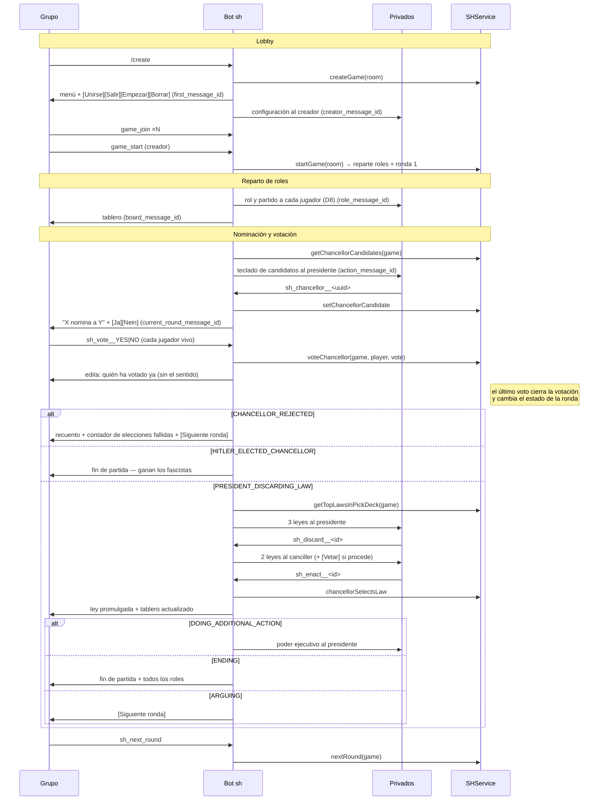

# Plan de implementación: SH-Telegram

> Proyecto nuevo `SH-Telegram`: capa de presentación/entrada de Telegram sobre `SH-Engine`.
> Parent: `org.themarioga:parent:2.0.0` (el BOM del reactor). Dependencias: `Commons-Telegram` + `sh-engine`.
> Fecha: 2026-08-29 · Decisiones de diseño: **cerradas** (§3) · Hermano mayor: [CAH-Telegram-PLAN.md](CAH-Telegram-PLAN.md)
> Estado: **S0, S1, S2 y S3 hechas** (2026-08-29) · siguiente: S4

---

## 1. Objetivo y alcance

Construir la **implementación Telegram de Secret Hitler**: el consumidor que hoy le falta a
`SH-Engine`, que es el único módulo del reactor sin nadie encima. El motor está funcionalmente
completo y con tests (lobby, reparto de roles, mazo de leyes, máquina de 10 estados de ronda, los
cinco poderes ejecutivos, el veto y todas las condiciones de victoria); lo que no existe es nada que
hable con Telegram.

El proyecto contiene **un solo bot** (SH no tiene el equivalente al bot de diccionarios de CAH):

| Bot | Rol | Chats |
|---|---|---|
| **SH bot** (juego) | Crear/configurar/jugar partidas de Secret Hitler | Grupo (mesa) + privado (rol, y toda acción secreta) |

**Diferencia de partida con CAH-Telegram:** aquel proyecto era un **porte** — existía
`Bots/CCLHBotServiceImpl` con 1496 líneas de renderizado que canibalizar y una interfaz de comandos
que había que respetar al pie de la letra porque ya estaba desplegada. Aquí **no hay nada**:
verificado que en `../Bots` no queda una sola clase de Secret Hitler. Es obra nueva, lo que cuesta
más trabajo de escritura y a cambio quita de en medio los dos riesgos caros de CAH: la migración de
datos legacy y la retrocompatibilidad de claves.

**Alcance:** paridad funcional con `CAH-Telegram` — lobby, configuración, partida completa con los
cinco poderes ejecutivos y el veto, comandos de administración, catálogo i18n en los dos idiomas,
tests de flujo y baseline de esquema en los dos dialectos.

**Fuera de alcance:** cambiar reglas de juego (viven en `SH-Engine`; lo que sí se toca son los huecos
de §5.1, que no son reglas), y tocar `CAH-Telegram` o su base de datos.

---

## 2. Punto de partida

### 2.1 Lo que se reutiliza tal cual

- **`Commons-Engine`** — `User`, `Room`, `Lang`, `Tag`, `UserService`, `RoomService`, `I18NService`,
  `SecurityUtils`, `UserDetails`, `AbstractHibernateDao`. PKs `UUID` (`Base`).
- **`Commons-Telegram`** — y esta vez de verdad: `UpdateDispatcher`, `AuthUpdateInterceptor`,
  `TelegramContext(+Holder)`, `TelegramSecurityUtils`, `TelegramSession`, `TelegramUserDetails`,
  `TelegramUser(+Dao,+Service)`, `TelegramRoomResolver`, `TelegramBotsRegistrarConfig`,
  `TelegramWebhookController`, `LongPolling/WebhookBotServiceImpl`, `BotMessageService(+Impl)`,
  `PendingReplyRegistry`, `SelectionRegistry`, `BotMessageUtils`, `TelegramAdmins`.
  **Todo el trabajo de F3/F4 de CAH-Telegram sirve sin tocar una línea.** Ese era el objetivo
  declarado de aquel plan ("para que `SH-Telegram` lo aproveche cuando exista") y se cumple.
- **`SH-Engine`** — `SHService` (fachada), `GameService`/`PlayerService`/`RoundService`, entidades
  `Game`/`Player`/`Round`/`Law`, `SHUtils`, `GameConfig`.
  **Clave, igual que en CAH:** `SHServiceImpl` toma el `Room` **por parámetro** y el `User` **de la
  sesión de seguridad** (`getSessionUser()`), y ya trae `createGame(Room)` (se añadió en la F1 de
  CAH-Telegram, §5.2 bis de aquel plan, precisamente para esto).

### 2.2 Lo que se copia de `CAH-Telegram` adaptándolo

No son dependencias — `SH-Telegram` **no** depende de `CAH-Telegram` — sino patrones ya probados que
se reescriben para SH:

| De CAH-Telegram | A SH-Telegram | Nota |
|---|---|---|
| `CAHTelegramApplication` | `SHTelegramApplication` | `scanBasePackages`/`@EntityScan` = `org.themarioga` |
| `SecurityConfig` | idéntico | solo abre `/callback/**` y el reto ACME |
| `CAHTelegramBotsConfig` | `SHTelegramBotsConfig` | un bot en vez de dos; misma estructura `@Bean` por modo |
| `BotProperties` | `BotProperties` (`sh.telegram.*`) | sin `dictionariesPerPage` |
| `ErrorMessageResolver` | igual, con la tabla de excepciones de SH | convención `ERROR_<NOMBRE>` |
| `TelegramRoom/Game/Player` + DAOs + `TelegramGameService` | mismo diseño, campos distintos (§6) | |
| `CAHTelegramRoomResolver` | `SHTelegramRoomResolver` | misma clave `"tg:<chatId>"` |
| `tools/SchemaGenerator` | `tools/SchemaGenerator` con las entidades de SH | herramienta, no test |
| `support/BotFlowTest` + `RecordingBotMessageService` | copiados | ver D7 |

### 2.3 Lo que no existe y hay que inventar

Todo el renderizado: tablero, mazos, reparto de roles, nominación, votación, sesión legislativa,
poderes ejecutivos, veto y fin de partida. Es la mayor parte del trabajo (§8).

### 2.4 Estado de `SH-Engine`: lo que le falta para poder tener un bot encima

Auditado leyendo `SHServiceImpl`, `GameServiceImpl`, `PlayerServiceImpl` y `SHUtils`. Seis huecos,
todos pequeños, todos en `SH-Engine` y no en el bot:

1. **No hay forma de preguntar quién ha ganado.** La partida acaba poniendo
   `GameStatusEnum.ENDING` en cuatro sitios distintos (5 leyes liberales, 6 fascistas, Hitler
   ejecutado, Hitler elegido canciller con ≥3 leyes fascistas) y **nadie guarda cuál de los cuatro
   fue**. El bot necesita anunciar ganador y motivo. → `SHService.getResult(Game)` (§5.1).
2. **Desde `presidentDiscardsLaw` en adelante el motor no comprueba quién actúa.** Valida el estado
   de la ronda, pero no que el que descarta sea el presidente ni que el que promulga sea el canciller
   (`voteChancellor` sí valida: jugador de la partida y vivo). Los botones van al privado del actor,
   así que en la práctica no es explotable, pero es una regla de juego y su sitio es el motor.
3. **`GameService.endGame` borra la fila y la fachada nunca lo llama** — mismo gotcha que CAH (nº 11
   del mapa). El bot tendrá que llamarlo él, y **recoger antes los ids de mensaje** (gotcha 30).
4. **`sh.game.default-min-number-of-players` tiene que ser 5.** `SHUtils.getRoleDistribution` solo
   conoce 5–10 jugadores y devuelve `null` fuera de ese rango; `assignRolesAndParties` lo convierte
   en `GameNotFilledException`. Las propiedades de test del motor traen `3`, que arrancaría la
   partida y reventaría al repartir roles (la transacción revierte, pero el usuario ve un error
   incomprensible). En `SH-Telegram` van 5 y 10, y el menú de configuración no ofrece otra cosa.
5. ~~**Las `Law` de los mazos se crean con `new Law(...)` y se meten en una `@OneToMany` con
   `@JoinTable` sin cascade**~~ ✅ **confirmado y corregido en S1.** Era un bug real y bloqueante:
   `initializeLawDeck()` revienta con `TransientPropertyValueException` en cuanto se vacía la sesión,
   así que **ninguna partida real podía empezar**. Los tests del motor no lo veían porque su fixture
   siembra el mazo con leyes ya persistidas (`persistLaw()`), y ese camino era el único cubierto.
   Corregido con `cascade = CascadeType.ALL` en los dos mazos de `Game`, con un test que ejerce
   `refillLawDeckIfNeeded()` contra un flush real.
6. **Los textos de `SHErrorEnum` son literales españoles.** Como en CAH, se traducen por convención
   `ERROR_<NOMBRE>` contra la tabla `tag`; el enum se queda como está (es el mensaje interno).

### 2.5 Ventaja frente a CAH-Telegram: no hay datos que migrar

La F2 de CAH-Telegram (2–3 jornadas, el riesgo alto del proyecto) fue rescatar diccionarios y cartas
de producción de un esquema `t_*` con PKs `BIGINT`. Aquí **no hay producción, ni bot desplegado, ni
partidas en curso**: la base de datos de SH nace vacía y su baseline se genera desde las entidades.
Se ahorra la fase entera y con ella:

- Ningún `legacy_data_migration.py`.
- Ningún UUID fijo cableado en propiedades (el `cah.game.default-dictionary-id` que hace que una BD
  recién creada de CAH **no pueda crear partidas**, gotcha 32, aquí no tiene equivalente: SH no
  necesita datos semilla más allá de `lang` y `tag`).
- Ninguna restricción de retrocompatibilidad en claves de comando y `callback_data`… **todavía**:
  en cuanto se despliegue la primera vez, pasan a ser contrato (§10, R3).

---

## 3. Decisiones de diseño (cerradas)

| # | Decisión | Resuelto |
|---|---|---|
| D1 | **Despliegue propio y base de datos propia**: `SH-Telegram` es su jar y su BD | ✔ |
| D2 | `SH-Telegram` **no** depende de `CAH-Telegram`; lo común ya está en `Commons-Telegram` | ✔ |
| D3 | Un solo bot, con `sh.bot.enabled` | ✔ |
| D4 | El esquema de SH es **generado** desde las entidades, como el de CAH | ✔ |
| D5 | **Toda acción secreta va por privado**; el grupo solo ve estado público | ✔ |
| D6 | La comprobación de "quién puede actuar" se **añade al motor**, no al bot | ✔ |
| D7 | El soporte de tests de flujo se **copia**, no se comparte por `test-jar` | ✔ |
| D8 | Hitler conoce a los fascistas **solo con 5 o 6 jugadores** — lo decide el bot | ✔ |
| D9 | Las claves de comando y `callback_data` se fijan con un test desde el primer día | ✔ |

### D1 — Despliegue propio y base de datos propia

`SH-Telegram` arranca su propia aplicación Spring Boot contra su propia BD, que contiene el esquema
completo: `lang`, `tag`, `users`, `room`, `telegram_user` **y** las tablas de SH. `CAH-Telegram` y su
base de datos quedan intactos.

**Por qué, y qué cuesta.** `org.themarioga.engine.cah.models.game.Game` y
`org.themarioga.engine.sh.models.Game` son las dos `@Entity` con el nombre simple `Game` y herencia
`TABLE_PER_CLASS`: **las dos mapean a la tabla `game`**, y lo mismo pasa con `player` y `round`.
Compartir base de datos exigiría renombrar las tablas de `SH-Engine` (`@Table(name = "sh_game")`…),
rehacer sus fixtures DBUnit y su `shschema.dtd`, y decidir cuál de los dos despliegues es el dueño de
las migraciones de las tablas comunes. Separando las bases de datos, **el problema no existe**: en el
contexto de persistencia de `SH-Telegram` solo hay entidades de SH, y `game` es la suya.

El precio, asumido: **la identidad no se comparte**. Quien haya hecho `/start` en el bot de CCLH
tiene que volver a hacerlo en el de SH, y el catálogo de tags comunes (`YES`, `NO`, `GO_BACK`,
`PLAYER_WELCOME`, los `ERROR_*` genéricos…) vive duplicado en las dos BD. A cambio, los dos
despliegues son independientes: se actualizan, se caen y se migran por separado.

### D2 — Sin dependencia entre las dos capas de Telegram

Lo genérico ya está en `Commons-Telegram`. Lo que se repite entre `CAH-Telegram` y `SH-Telegram`
(las tres entidades `telegram_*`, el resolutor de salas, el `ErrorMessageResolver`) se parece pero
**no es lo mismo**: `TelegramGame` guarda ids de mensajes distintos y el mapa de errores es de otro
juego. Extraer una superclase para ahorrar 200 líneas ataría los dos despliegues por el módulo
común y obligaría a versionar `Commons-Telegram` con cuidado en cada cambio de cualquiera de los
dos. Se copia.

Lo único que sí conviene subir a `Commons-Telegram` si aparece una tercera copia: `TelegramRoom`,
que es idéntica en los dos (`chatId → Room`, sin nada del juego). Queda anotado, no se hace ahora.

### D3 — Un solo bot

`sh.bot.enabled` / `sh.bot.token` / `sh.bot.name`, con la misma estructura de `SHTelegramBotsConfig`
que en CAH (dirección `TelegramClient → BotMessageService → ApplicationService → bot`, un `@Bean` por
modo con `@ConditionalOnProperty` sobre `telegram.bots.type`). Se mantiene la estructura de dos
`@Configuration` anidadas aunque solo haya un bot: es lo que evita los dos `@Bean` con el mismo
nombre que Boot 4 rechaza (§11 bis del plan de CAH).

### D4 — El esquema es generado

`src/test/java/…/tools/SchemaGenerator.java` copiado de CAH con la lista de entidades de SH, y las
mismas naming strategies de Spring Boot 4.1 y el mismo `DatabaseVersion.make(10, 7)` de MariaDB (el
javadoc de esa clase explica por qué está fijada: generar con 10.6 y validar contra 10.7 rompe el
arranque con "wrong column type encountered in column [id]"). `ddl-auto=validate` +
`SchemaBaselineTest` cierran el bucle.

### D5 — Toda acción secreta va por privado

Secret Hitler es un juego de información oculta, y esto no es solo estética: si el bot manda al grupo
el teclado con las tres leyes que ve el presidente, se acabó la partida.

| Va al **grupo** | Va al **privado** |
|---|---|
| Tablero (leyes promulgadas, contador de elecciones fallidas, veto) | Rol y partido de cada jugador (y compañeros, ver D8) |
| Quién es presidente y a quién nomina | Elección de canciller (teclado del presidente) |
| Los botones de votar (Ja/Nein) y quién ha votado ya | Las tres leyes del presidente y su descarte |
| El recuento revelado al cerrar la votación | Las dos leyes del canciller y su promulgación |
| Qué ley se promulga y qué poder se desbloquea | El resultado de investigar lealtad y de espiar el mazo |
| A quién se ejecuta o se investiga (el hecho, no el resultado) | La propuesta de veto y su resolución |
| Fin de partida con todos los roles revelados | La elección de objetivo de cada poder ejecutivo |

**Consecuencia de diseño:** el bot trabaja siempre con **dos chats a la vez**, igual que el de CAH
con la mano de cartas, y cada mensaje que edita o borra hay que dirigirlo al chat correcto. Ninguno
de esos identificadores está en las entidades del motor: de ahí `telegram_game`/`telegram_player`
(§6).

### D6 — Quién puede actuar lo comprueba el motor

`presidentDiscardsLaw`, `chancellorSelectsLaw`, `proposeVeto`, `resolveVeto`, `killPlayer`,
`investigatePlayer`, `callSpecialElection` y `peekTopLaws` no comprueban hoy que el que llama sea el
presidente o el canciller de la ronda. Es una **regla de juego**, y el motor ya sabe leer el usuario
de la sesión (`getSessionUser()`, `checkSessionUserIsCreator`). Se añaden ahí (S1), no en el bot:
así valen para la futura implementación web o de Discord, y el bot no tiene que replicarlas.

### D7 — El soporte de tests se copia

`BotFlowTest` y `RecordingBotMessageService` viven en `src/test` de `CAH-Telegram`. Publicarlos como
`test-jar` para reutilizarlos crearía una dependencia de `SH-Telegram` sobre `CAH-Telegram` justo la
que D2 evita. Son ~150 líneas: se copian.

### D8 — Hitler conoce a los fascistas solo con 5 o 6 jugadores

Regla real de Secret Hitler que el motor **no modela** (`assignRolesAndParties` reparte roles y
nada más). Es información de presentación —quién ve qué en su mensaje de rol— así que la decide el
bot al componer el mensaje: con 5 o 6 jugadores, el mensaje de Hitler lista a los fascistas y el de
cada fascista lista a Hitler y a sus compañeros; con 7 o más, Hitler solo ve su propio rol.

### D9 — Las claves se fijan desde el primer día

Aquí no hay bots desplegados, así que las claves se eligen libres. Pero **en cuanto se envíe el
primer mensaje pasan a ser contrato para siempre** (Telegram guarda los botones dentro de los
mensajes), que es exactamente el gotcha 31 de CAH. Se escribe desde S3 un
`SHApplicationServiceTest` que fija los conjuntos exactos de comandos y callbacks y falla si alguien
los toca — el mismo test que en CAH se escribió *después*, cuando ya dolía.

---

## 4. Arquitectura destino

```
                        ┌──────────────────────────────────────────┐
   Telegram Update ───► │ Commons-Telegram          (SIN CAMBIOS)  │
                        │  UpdateDispatcher                        │
                        │   └─ AuthUpdateInterceptor ──────────────┼──► telegram_user (mapeo)
                        │        · resuelve TelegramUser           │        │
                        │        · SecurityUtils.setUserDetails()  │        ▼
                        │        · TelegramContextHolder.set()     │   engine-commons: User + Lang
                        │        · finally → clear()               │
                        └───────────────────┬──────────────────────┘
                                            │ CommandHandler / CallbackQueryHandler
                        ┌───────────────────▼──────────────────────┐
                        │ SH-Telegram                     (NUEVO)  │
                        │  SHApplicationServiceImpl   (comandos)   │
                        │        │                                 │
                        │        ▼                                 │
                        │  SHTelegramService (orquesta + render)   │──► telegram_room / telegram_game
                        │   · tablero, roles, votación, leyes      │    telegram_player
                        │   · dos chats: grupo + privado           │
                        └───────────────────┬──────────────────────┘
                                            ▼
                        ┌──────────────────────────────────────────┐
                        │ SH-Engine: SHService (Room o Game por    │
                        │            parámetro, User de sesión)    │
                        └──────────────────────────────────────────┘

   BD propia: lang · tag · users · room · telegram_user ·
              game · player · round · law · mazos · telegram_room/game/player
```

**Regla de oro, igual que en CAH:** `SH-Telegram` **nunca** habla de `chatId` con el motor, y el
motor **nunca** sabe qué es Telegram. La traducción `chatId ↔ Room` y `telegramUserId ↔ User` ocurre
solo en la frontera.

**Asimetría propia de SH que conviene tener presente:** la fachada de CAH recibe `Room` en casi todo;
la de SH recibe `Room` en el lobby (`createGame`, `addPlayer`, `startGame`, `voteForDeletion`…) y
**`Game` en toda la ronda** (`setChancellorCandidate`, `voteChancellor`, `presidentDiscardsLaw`…).
El bot resuelve `Room` → `Game` con `gameService.getByRoom(room)` una vez por handler y sigue.

---

## 5. Reparto por módulo

### 5.1 Cambios en `SH-Engine` (S1) ✅ HECHO

| Fichero | Cambio |
|---|---|
| `enums/GameResultEnum.java` (nuevo) | `LIBERAL_LAWS`, `FASCIST_LAWS`, `HITLER_EXECUTED`, `HITLER_ELECTED_CHANCELLOR` |
| `models/Game.java` | + `result` (`@Enumerated(STRING)`, `@JdbcTypeCode(VARCHAR)`, nullable — como `party`/`role` de `Player`) |
| `service/impl/GameServiceImpl.java` | + `setResult(Game, GameResultEnum)`; se llama en los cuatro sitios donde hoy solo se pone `ENDING` |
| `service/intf/SHService.java` + impl | + `GameResultEnum getResult(Game)`; + `List<Player> getWinners(Game)` (los del partido ganador, para revelar roles) |
| `service/impl/SHServiceImpl.java` | Comprobación de actor (D6) en `presidentDiscardsLaw`, `chancellorSelectsLaw`, `proposeVeto`, `resolveVeto`, `peekTopLaws`, `investigatePlayer`, `callSpecialElection`, `killPlayer`: el usuario de sesión debe ser el presidente (o el canciller donde toque) de la ronda en curso → `GameOnlyCreatorCanPerformActionException` no vale, hace falta un error propio (`PLAYER_CANNOT_PERFORM_ACTION`, código 42) |
| `enums/SHErrorEnum.java` | + `PLAYER_CANNOT_PERFORM_ACTION(42L, …)` |
| Tests | `SHServiceTest`: fijar el `result` esperado en los cuatro finales; cubrir los rechazos por actor incorrecto |

**Verificación previa (bloqueante, §2.4 punto 5): hecha, y el bug era real.** Se corrigió con
`cascade = CascadeType.ALL` en `Game.lawPickDeck` y `Game.lawDiscardDeck`. **No** se le puso cascade
a `Round.roundAvailableLaws` a propósito: `chancellorSelectsLaw()` deja la ley sobrante apuntada a la
vez desde la ronda y desde el mazo de descartes, y como la ronda se borra en cada `nextRound()`, un
cascade ahí borraría una ley que sigue en juego. El precio es que las leyes que estén en la ronda
cuando se borre la partida quedan huérfanas (3 filas como mucho), y queda anotado en el propio
modelo.

> ⚠️ Recordatorio del plan de CAH que aquí vuelve a aplicar: `maven-compiler-plugin` **no recompila**
> un módulo cuyas fuentes no han cambiado aunque sí haya cambiado la librería de la que depende.
> Verificar siempre con `mvn clean install`, nunca con `mvn install`.

### 5.2 Cambios en `Commons-Telegram`

**Ninguno previsto.** Es la prueba de fuego del diseño de `Commons-Telegram`: si aparece algo, será
una señal de que quedó lógica de CAH colada en el módulo común, y se corrige ahí (con `CAH-Telegram`
compilando en el mismo reactor, así que la regresión se ve en el acto).

Candidato conocido a subir si hace falta: `TelegramRoom` (D2).

### 5.3 Nuevo en `SH-Telegram`

| Clase | Paquete | Qué hace |
|---|---|---|
| `SHTelegramApplication` | `org.themarioga.telegram.sh` | `@SpringBootApplication(scanBasePackages="org.themarioga")`, `@EntityScan("org.themarioga")` |
| `SecurityConfig` | `…sh.config` | Abre `POST /callback/**` y `/.well-known/acme-challenge/**` |
| `SHTelegramBotsConfig` | `…sh.config` | Cliente, `BotMessageService` y bot, por modo (D3) |
| `BotProperties` | `…sh.config` | `@ConfigurationProperties("sh.telegram")`: nombre, alias, versión, ownerAlias, helpUrl |
| `ErrorMessageResolver` | `…sh.config` | `ErrorEnum → tag`, convención `ERROR_<NOMBRE>` + tabla de excepciones |
| `TelegramErrorEnum` | `…sh.exceptions` | Errores de la capa de Telegram, códigos desde 100 |
| `TelegramRoom` | `…sh.models` | `id` (chatId) → `Room`. **Permanente** |
| `TelegramGame` | `…sh.models` | Ids de mensaje de la partida. **Efímera** (§6) |
| `TelegramPlayer` | `…sh.models` | Ids de mensaje del privado de cada jugador. **Efímera** |
| DAOs de los 3 | `…sh.dao.{intf,impl}` | Sobre `AbstractHibernateDao` |
| `TelegramGameService(+Impl)` | `…sh.services` | Correspondencia motor ↔ ids de mensaje; `getChatId(Room)` |
| `SHTelegramRoomResolver` | `…sh.services.impl` | `TelegramRoomResolver` sobre `telegram_room` |
| `SHApplicationServiceImpl` | `…sh.game.app` | Tabla de comandos y callbacks (§8) |
| `SHTelegramService(+Impl)` | `…sh.game.service` | Orquesta `SHService` + renderiza (la clase grande, ~1000–1200 líneas) |
| `BoardRenderer` | `…sh.game.render` | Tablero, mazos y estado de ronda a texto. **Separado a propósito**: en CAH el renderizado quedó dentro del servicio y la clase se fue a 1107 líneas |
| `tools/SchemaGenerator` | `src/test/…/tools` | Herramienta, no test |

---

## 6. Modelo de datos

Las tablas de `Commons-Engine`, `SH-Engine` y `Commons-Telegram` son las que ya definen esos módulos;
lo único nuevo son las tres de abajo. Esquema completo de la BD de SH (17 tablas):

```
-- Commons-Engine        lang · tag · users · room · game_deletion_votes
-- SH-Engine             game · player · round · law
--                       game_law_pick_deck · game_law_discard_deck
--                       round_available_laws · round_votes
-- Commons-Telegram      telegram_user
-- SH-Telegram           telegram_room · telegram_game · telegram_player

telegram_room                                  -- permanente: el grupo sobrevive a las partidas
  id            BIGINT PK                      -- id de chat de grupo de Telegram
  room_id       UUID NOT NULL UNIQUE FK → room(id)

telegram_game                                  -- efímera: vive lo que la partida
  game_id                  UUID PK FK → game(id)
  first_message_id         INT NOT NULL        -- mensaje del grupo con el menú y el botón de unirse
  creator_message_id       INT NOT NULL        -- privado desde el que el creador configura
  board_message_id         INT                 -- mensaje del grupo con el tablero (se edita cada ronda)
  current_round_message_id INT                 -- mensaje del grupo de la fase en curso (votación, etc.)

telegram_player                                -- efímera
  player_id         UUID PK FK → player(id)
  role_message_id   INT NOT NULL               -- privado con el rol, el partido y (D8) los compañeros
  action_message_id INT                        -- privado con la acción pendiente de ese jugador
```

**Por qué `board_message_id` y `current_round_message_id` separados.** El tablero (leyes promulgadas,
elecciones fallidas, veto) es información **acumulativa** que interesa tener a la vista toda la
partida: un solo mensaje que se edita. La fase en curso (nominación, votación, "el presidente está
legislando") es información **volátil** de una ronda concreta. En un único mensaje, cada votación
empujaría el tablero fuera de la pantalla o lo pisaría. En CAH bastaba con
`current_round_message_id` porque la carta negra *es* toda la ronda.

**Por qué `action_message_id` en el jugador.** Es el equivalente de `hand_message_id` de CAH: el
privado que el bot edita para pedirle a ese jugador lo que le toca (elegir canciller, descartar,
promulgar, elegir objetivo de un poder) y que se edita otra vez para confirmar. `role_message_id` es
aparte porque el rol se manda una vez al empezar y no se toca más.

**Consultas que hay que soportar:**
- `telegram_game` por `game.creator` → `/deletemygames`
- `telegram_game` todas → `/deleteallgames` (y avisar a cada grupo)
- `telegram_player` por `player.game` → repartir roles, pedir acciones, limpiar al terminar
- `telegram_player` por `player` → escribir al privado del jugador que toca
- `telegram_user` por `user_id` → escribir por privado a un `User` del motor (ya en `Commons-Telegram`)

> ⚠️ Gotcha 2 del mapa, el que hacía que **crear partida fallara siempre** en CAH-Telegram:
> `TelegramGame` y `TelegramPlayer` tienen el id derivado de una asociación, así que **`createOrUpdate`
> (merge) no puede insertarlas** ("Identifier may not be null"). Hay que usar `create` (persist).

---

## 7. Usuario, sesión y sala

Todo esto ya funciona y no se toca; se documenta lo que `SH-Telegram` **da por hecho**:

- **Registro solo con `/start` en privado** (D7 del plan de CAH). Sin `/start` el bot no puede
  escribirte por privado, y en SH eso es aún más terminante que en CAH: sin privado no se puede ni
  recibir el rol. Cualquier otro comando de un usuario sin mapeo responde
  `ERROR_USER_NOT_REGISTERED` invitando a hacer `/start`.
- **Sesión por update**: `AuthUpdateInterceptor` resuelve `TelegramUser`, deja
  `TelegramUserDetails` en el `SecurityContextHolder` y el `TelegramContext` en su `ThreadLocal`, y
  **los limpia siempre en el `after`**.
- **Sala perezosa**: `TelegramContext.getRoom()` llama a `SHTelegramRoomResolver`, que traduce
  `chatId → Room` por `telegram_room` con la clave `"tg:<chatId>"` (nunca por el título del grupo:
  dos grupos pueden llamarse igual y acabarían compartiendo partida).
- **Trabajo asíncrono**: toda continuación de `sendMessageAsync` va envuelta en
  `TelegramSession.capture()` / `session.run(...)`. Sin eso no hay usuario ni chat en el hilo del
  pool (gotcha 22). En SH esto se usa igual que en CAH al crear la partida, y además al repartir los
  roles: son N envíos privados de los que hay que quedarse con los `message_id`.

**Del privado al grupo.** Muchos callbacks de SH llegan por el privado del jugador
(`chatId` = su id de usuario) pero tienen que actualizar el mensaje del grupo. El camino es
`TelegramGameService.getChatId(room)`, igual que en CAH. **El `TelegramContext` de esos updates NO
tiene la `Room` de la partida** — apunta al chat privado —, así que la partida se resuelve por el
jugador: `playerService.findByUser(sessionUser)` → `player.getGame()` → `game.getRoom()`. Es la
consulta que el gotcha 4 hace fiable (un usuario, una partida, en todo el sistema) y frágil a la vez
(una fila huérfana bloquea entrar a cualquier partida nueva).

---

## 8. Superficie del bot

### 8.1 Comandos

| Comando | Chat | Qué hace |
|---|---|---|
| `/start` | privado | Registro (`TelegramUserService.register`) |
| `/lang` | privado | Menú de idioma |
| `/create` | grupo | Crea la partida en la sala del grupo |
| `/help` | ambos | Ayuda y enlace al manual |
| `/deletemygames` | privado | Borra las partidas de las que eres creador |
| `/deletegamebyusername` | privado, admin | Borra la partida de un creador |
| `/deleteallgames` | privado, admin | Borra todas y avisa a cada grupo |
| `/sendmessagetoeveryone` | privado, admin | Difusión |
| `/toggleglobalmessages` | privado, admin | Interruptor de la difusión |

Mismo patrón que en CAH: cada handler comprueba primero que el comando llega en el tipo de chat
correcto (`BotMessageUtils.isMessagePrivate`) y responde `ERROR_COMMAND_SHOULD_BE_ON_{PRIVATE,GROUP}`
si no.

### 8.2 Callbacks

Convención `clave__payload` (el dispatcher parte por `__`). Prefijo `sh_` en lo específico del juego
para que no se confundan con los del lobby, que son calcados a los de CAH.

| Clave | Payload | Chat | Quién puede |
|---|---|---|---|
| `change_user_lang` | id de idioma | privado | cualquiera |
| `game_menu` | — | grupo | cualquiera |
| `game_configure` | — | grupo | creador |
| `game_sel_max_players` | — | privado creador | creador |
| `game_change_max_players` | 5–10 | privado creador | creador |
| `game_join` | — | grupo | cualquiera registrado |
| `game_leave` | — | grupo | jugador |
| `game_start` | — | grupo | creador |
| `game_delete_group` | — | grupo | creador (o voto de borrado si ya empezó) |
| `game_delete_private` | — | privado | creador |
| `sh_chancellor` | UUID de jugador | privado presidente | presidente |
| `sh_vote` | `YES` / `NO` | grupo | jugador vivo, una vez |
| `sh_discard` | id de ley | privado presidente | presidente |
| `sh_enact` | id de ley | privado canciller | canciller |
| `sh_veto` | — | privado canciller | canciller, con veto activo |
| `sh_veto_resolve` | `YES` / `NO` | privado presidente | presidente |
| `sh_action` | nombre de `RoundActionsEnum` | privado presidente | presidente, si hay más de un poder |
| `sh_investigate` | UUID de jugador | privado presidente | presidente |
| `sh_special_election` | UUID de jugador | privado presidente | presidente |
| `sh_kill` | UUID de jugador | privado presidente | presidente |
| `sh_next_round` | — | grupo | cualquier jugador |

`POLICY_PEEK` y `ENABLE_VETO` no tienen callback: no piden elección, se ejecutan y se anuncian.

La columna "quién puede" la impone **el motor** tras S1 (D6); el bot no repite la comprobación, solo
traduce el error con `ErrorMessageResolver`. Lo que sí hace el bot es no ofrecer el botón a quien no
toca — que los mande al privado del actor ya lo consigue casi entero.

### 8.3 Flujo de una partida



**Los tres puntos donde el bot tiene que mirar el estado que le devuelve el motor**, porque una sola
llamada puede terminar la partida:

1. `voteChancellor` — el último voto puede dejar la ronda en `CHANCELLOR_REJECTED`,
   `HITLER_ELECTED_CHANCELLOR` o `PRESIDENT_DISCARDING_LAW`.
2. `chancellorSelectsLaw` — puede llevar a `ENDING` (umbral de leyes),
   `DOING_ADDITIONAL_ACTION` o `ARGUING`, y de paso activar el veto.
3. `nextRound` — con 3 elecciones fallidas promulga una ley automáticamente, **y esa ley puede
   terminar la partida**. Es el camino más fácil de olvidar.

**Fin de partida**, en este orden exacto (gotcha 30):

1. `shService.getResult(game)` y `getWinners(game)`, y recoger **todos** los ids de mensaje de
   `telegram_game` y `telegram_player`.
2. Anunciar en el grupo: ganador, motivo y el rol de cada jugador.
3. Limpiar los privados (borrar o editar los mensajes de rol y de acción).
4. `telegramGameService.deleteGameData(game)` y `gameService.endGame(game)`.

Una vez borrada la fila padre las relaciones JPA ya no se pueden recorrer: si se hace al revés, no
hay a quién escribir.

---

## 9. Catálogo i18n

**Todo texto visible es un tag de la tabla `tag`.** Un literal español en el código hace fallar un
test. Van en `V2.0.0_2__Languages_and_tags.sql`, **en los dos idiomas y los dos dialectos**.

Tres bloques:

1. **Comunes, copiados del catálogo de CAH** (~40): `YES`, `NO`, `GO_BACK`, `ACCEPT`, `CANCEL`,
   `PLAYER_WELCOME`, `USER_LANG_CHANGE`, `USER_LANG_CHANGED`, `UNKNOWN_ERROR`,
   `ALL_MESSAGES_SENT`, `ERROR_COMMAND_SHOULD_BE_ON_{GROUP,PRIVATE}`, `ERROR_SELECTION_INVALID`,
   y los `ERROR_*` de `CommonErrorEnum` (`ERROR_GAME_*`, `ERROR_PLAYER_*`, `ERROR_USER_*`,
   `ERROR_ROOM_NOT_ACTIVE`, `ERROR_ROUND_*`). Se traen **con el mismo nombre**: son los que
   `ErrorMessageResolver` deduce por convención.
2. **Errores propios de SH** (9, uno por valor de `SHErrorEnum` más el nuevo de D6):
   `ERROR_PLAYER_ALREADY_VOTED`, `ERROR_PLAYER_ALREADY_DEAD`, `ERROR_PLAYER_CANNOT_BE_KILLED`,
   `ERROR_PLAYER_NOT_VALID_CHANCELLOR_CANDIDATE`, `ERROR_LAW_NOT_FOUND`,
   `ERROR_PLAYER_CANNOT_BE_INVESTIGATED`, `ERROR_PLAYER_CANNOT_BE_ELECTED`,
   `ERROR_VETO_NOT_ACTIVE`, `ERROR_PLAYER_CANNOT_PERFORM_ACTION`.
   (`ERROR_ROUND_*` y `ERROR_GAME_{ALREADY,NOT}_FILLED` ya están en el bloque 1.)
3. **Del juego** (~60 nuevos): `SH_GAME_CREATED_GROUP`, `SH_GAME_HELP`, `SH_BOARD`,
   `SH_ROLE_LIBERAL`, `SH_ROLE_FASCIST`, `SH_ROLE_HITLER`, `SH_ROLE_FELLOW_FASCISTS`,
   `SH_PRESIDENT_SELECT_CHANCELLOR`, `SH_CHANCELLOR_NOMINATED`, `SH_VOTE_JA`, `SH_VOTE_NEIN`,
   `SH_VOTE_CAST`, `SH_VOTE_RESULT_PASSED`, `SH_VOTE_RESULT_REJECTED`, `SH_ELECTION_TRACKER`,
   `SH_LAW_AUTO_ENACTED`, `SH_PRESIDENT_DISCARD`, `SH_CHANCELLOR_ENACT`, `SH_LAW_LIBERAL`,
   `SH_LAW_FASCIST`, `SH_VETO_PROPOSED`, `SH_VETO_ACCEPTED`, `SH_VETO_REJECTED`,
   `SH_VETO_UNLOCKED`, `SH_POWER_INVESTIGATE*`, `SH_POWER_SPECIAL_ELECTION*`, `SH_POWER_PEEK*`,
   `SH_POWER_EXECUTION*`, `SH_WIN_LIBERAL_LAWS`, `SH_WIN_FASCIST_LAWS`, `SH_WIN_HITLER_EXECUTED`,
   `SH_WIN_HITLER_CHANCELLOR`, `SH_GAME_ROLES_REVEALED`, `SH_NEXT_ROUND_BUTTON`…

> ⚠️ El caché de i18n **no se invalida** (gotcha 7): `I18NServiceImpl` carga todos los pares
> `Lang`×`Tag` en memoria en el constructor. Tocar la tabla `tag` exige reiniciar. Y el `\n` literal
> del SQL se convierte en salto de línea real al cargar.

Un test de catálogo (como el de CAH) recorre por reflexión las claves usadas y falla si falta alguna
en cualquiera de los dos idiomas.

---

## 10. Riesgos

**R1 — Las `Law` transitorias** ✅ **resuelto en S1** (§2.4 punto 5). Era un bug real: obligó a
tocar el modelo del motor (cascade en los dos mazos de `Game`).

**R2 — Información filtrada al chat equivocado.** El fallo específico de este juego: mandar al grupo
un teclado que era para el privado del presidente arruina la partida y no lo detecta ningún test de
compilación. **Mitigación:** un test de flujo que, tras cada acción, comprueba sobre
`RecordingBotMessageService` que **ningún mensaje enviado al chat de grupo contiene un rol, una ley
concreta del mazo ni el resultado de una investigación**. Es barato de escribir y es la red de
seguridad principal del proyecto.

**R3 — Las claves se congelan en el primer despliegue.** Hoy son libres; en cuanto Telegram guarde
el primer botón, cambiarlas rompe partidas en curso. De ahí D9: el test que las fija se escribe en
S3, no cuando duela.

**R4 — Concurrencia en la votación.** En SH todos los jugadores votan **a la vez**, que es
exactamente el caso que el motor no protege: sin bloqueo optimista ni pesimista (gotcha 17), dos
`voteChancellor` simultáneos pueden entrelazarse y hacer que `checkIfVotationEndedAndChangeStatus`
no dispare, dejando la ronda colgada. Bajo **long polling no puede pasar** (un solo hilo procesa los
updates); bajo **webhook sí**. Es más probable aquí que en CAH, donde las jugadas son secuenciales.
**Mitigación:** desplegar en long polling mientras no haya `@Version` en `Round`/`Game`, y si se pasa
a webhook, añadirlo con reintento. Documentado, no bloqueante.

**R5 — Llamadas a Telegram dentro de transacciones** (gotcha 36, "R4" en el plan de CAH). Mismo
patrón recomendado: transacción → commit → enviar → transacción corta para guardar los
`message_id`. En SH el reparto de roles son N envíos seguidos, así que el efecto es mayor. No se
optimiza sin medir, pero el reparto de roles conviene sacarlo de la transacción desde el principio.

**R6 — Jugadores muertos.** Un jugador ejecutado sigue en la partida, en el grupo y con su privado
abierto. El motor valida el voto (`PlayerAlreadyDeadException`), pero el bot tiene que acordarse de
**no** contarlo para los quórums que calcule él, de no ofrecerle botones y de no incluirlo en las
listas de candidatos (el motor ya filtra en `getChancellorCandidates`/`getKillablePlayers`; lo que no
filtra es a quién le enseña el bot un teclado).

**R7 — Partidas abandonadas.** Sin bot desplegado no hay experiencia previa, pero una partida de SH
dura bastante más que una de CAH y basta con que el presidente de turno desaparezca para dejarla
clavada. No hay temporizadores en el motor ni en `Commons-Telegram`. **Alcance de este plan:**
`/deletemygames` y el voto de borrado del grupo. Un barrido por antigüedad queda anotado como
trabajo posterior.

---

## 11. Plan de trabajo por fases

### S0 — Módulo en el reactor (½ jornada) ✅ HECHA

- [x] `SH-Telegram` en `<modules>` del pom raíz, el último del reactor.
- [x] `pom.xml` del módulo, calcado del de `CAH-Telegram`: parent `org.themarioga:parent:2.0.0`,
      `sh-engine` + `commons-telegram`, Flyway (**`spring-boot-flyway`** además de `flyway-core`,
      gotcha 35), testcontainers de MariaDB en `test`, y los perfiles `dev`/`pre`/`pro` con su driver.
- [x] Estructura de paquetes bajo `org.themarioga.telegram.sh` y los dos ficheros de
      `src/main/resources` que el perfil `check` espera en cada módulo
      (`default-formatter-config.xml`, `supressed-cve-exceptions.xml`).
- [x] `SHTelegramApplication` — adelantada de S3 porque `spring-boot-maven-plugin:repackage` no
      empaqueta un módulo sin clase principal, y sin ella el módulo no podía entrar en el reactor.

**Aceptación:** ✅ `mvn clean install` verde con los siete módulos.

Decisiones y hallazgos de la fase:

- **No entra en el BOM.** El `dependencyManagement` del pom raíz solo versiona los artefactos de los
  que depende alguien (`commons-engine`, `cah-engine`, `sh-engine`, `commons-telegram`);
  `cah-telegram` tampoco está, porque de una aplicación desplegable no depende nadie.
- **`@EntityScan` cambió de paquete en Spring Boot 4**: es
  `org.springframework.boot.persistence.autoconfigure.EntityScan`, no
  `org.springframework.boot.autoconfigure.domain.EntityScan`. La compilación falla con "package does
  not exist", que es fácil de confundir con una dependencia mal puesta.
- **Queda pendiente una decisión que no es mía:** los otros cinco módulos son submódulos git con su
  propio repositorio, y `SH-Telegram` está de momento como directorio normal dentro del
  superproyecto, porque convertirlo en submódulo exige crear antes el repositorio remoto.

### S1 — Cerrar los huecos de `SH-Engine` (1–1½ jornadas) ✅ HECHA

- [x] **R1 verificado, y era un bug real** (§2.4 punto 5): `initializeLawDeck()` revienta con
      `TransientPropertyValueException` contra un flush real. Corregido con cascade en los dos mazos
      y cubierto con `testRefillLawDeck_BuildsAndPersistsAFreshDeck`.
- [x] `GameResultEnum` (con el partido ganador dentro) + `Game.result` + `GameService.setResult`,
      puesto en los **cuatro** finales: umbral de leyes al promulgar, umbral de leyes al promulgar
      automáticamente por la regla del caos, Hitler ejecutado y Hitler elegido canciller.
- [x] `SHService.getResult(Game)` y `getWinners(Game)`.
- [x] Comprobación de actor (D6) en nueve métodos + `SHErrorEnum.PLAYER_CANNOT_PERFORM_ACTION` (42)
      y su excepción.
- [x] Tests: 6 nuevos y 7 adaptados; `shschema.dtd` con la columna `result`.

**Aceptación:** ✅ `mvn -Ptest clean install` verde en **todo el reactor** — **417 tests**
(Commons-Engine 49 · CAH-Engine 207 · SH-Engine 85 · Commons-Telegram 26 · CAH-Telegram 50).
SH-Engine pasa de 79 a 85.

Hallazgos de la fase:

- **`setChancellorCandidate` también estaba sin comprobar**, así que la comprobación de actor son
  nueve métodos y no ocho: nominar canciller es cosa del presidente igual que descartar una ley.
- **Hitler elegido canciller no ponía la partida en `ENDING`**, solo la ronda. Las otras tres
  condiciones de victoria sí lo hacían. Corregido de paso: si no, el consumidor tiene que
  distinguir el fin de partida mirando el estado de la ronda en un caso y el de la partida en los
  otros tres.
- **Las comprobaciones de actor van después de las de estado**, para que un botón viejo siga
  respondiendo "mesa en estado incorrecto" en vez de "no puedes hacer esto", que confunde más.
- **Los tests del motor ahora necesitan sesión.** Se añadió un `loginAs(Player)` que deja al usuario
  del jugador en el `SecurityContext`, igual que hace `CAHServiceTest`.
- 🔴 **Los tests con base de datos de todo el reactor estaban rojos**, y no por SH: 56 errores en
  `CAH-Engine` y los 79 de `SH-Engine`, todos `DatabaseUnitException` por violación de clave ajena
  al montar los fixtures. La causa: **los ficheros DBUnit declaran el DTD, y DbUnit toma de ahí la
  lista de tablas de cada dataset**, no de las filas que trae el fichero. Consecuencias:
  1. Cada `@DatabaseSetup` repetido hacía `CLEAN_INSERT` de las **siete** tablas del DTD, borrando lo
     que había insertado el anterior. Se arregla fusionándolos en uno solo:
     `@DatabaseSetup({"a.xml", "b.xml"})`.
  2. Ya fusionados, el orden de inserción es el **orden de declaración del DTD**, que era alfabético
     (`Game, Lang, Player, Room, Tag, Users, Round`) e insertaba `Game` antes que `Users`. Se arregla
     ordenando el `<!ELEMENT dataset ...>` por dependencias.
  3. Los `@DatabaseSetup` a nivel de método volvían a vaciarlo todo. Se arregla con
     `type = DatabaseOperation.REFRESH`, que es además lo que querían decir: añadir filas sobre el
     fixture de la clase. Excepción: `game_deletion_votes` no tiene clave primaria y `REFRESH` no
     puede con ella, así que va aparte (su fichero no declara DTD, y por eso su `CLEAN_INSERT` solo
     la toca a ella).

  Aplicado a `SH-Engine` y, después, a **`CAH-Engine`**, donde bastaron dos cambios (fusionar las
  siete anotaciones de `CAHServiceTest` y reordenar `cahschema.dtd`) para recuperar sus 207 tests:
  allí no hay `@DatabaseSetup` a nivel de método. **`CAH-Telegram` no estaba afectado** —no usa
  DBUnit—, solo no llegaba a ejecutarse porque el reactor se paraba antes en `CAH-Engine`.

### S2 — Esquema propio y catálogo i18n (1½–2 jornadas) ✅ HECHA

- [x] `SchemaGenerator` con las 14 entidades de SH; baseline generado para los dos dialectos en
      `db/migration/{h2,mariadb}/V1/V1.0.0_1__Baseline.sql` — **17 tablas**.
- [x] `V1.0.0_2__Languages_and_tags.sql` en los dos dialectos: **137 tags × 2 idiomas = 274 filas**,
      58 traídos de CAH-Telegram con el mismo nombre y texto y 79 escritos para SH.
- [x] `SchemaBaselineTest` (H2, 8 tests) y `SchemaBaselineMariaDbTest` (testcontainers, 5 tests).
- [x] `application.properties` + perfiles `dev`, `pre` y `pro`, y el `application.properties` de test.
      `sh.game.default-min-number-of-players=5` y `default-max=10` (§2.4 punto 4).

**Aceptación:** ✅ `mvn -Pdev spring-boot:run` arranca contra una BD vacía: Flyway aplica las dos
migraciones y Hibernate valida el esquema resultante. Y —a diferencia de CAH— **una BD recién creada
ya puede crear partidas**: no hay ningún UUID semilla cableado en las propiedades.

Decisiones de la fase:

- **El orden de trabajo real fue S3 → S2 → tests de S3.** El generador de esquema necesita las tres
  entidades `telegram_*`, que son de S3; en CAH-Telegram pasó lo mismo y se resolvió regenerando el
  baseline en F4. Aquí, al hacer las dos fases seguidas, se generó una sola vez y con todo dentro.
- **Los tags comunes se copian con el mismo nombre y el mismo texto.** Es duplicación deliberada
  (D1: cada despliegue tiene su base de datos), y mantener los nombres permite que
  `ErrorMessageResolver` funcione por convención en los dos proyectos.
- **El `ErrorMessageResolver` de SH no necesita tabla de excepciones**, a diferencia del de CAH: el
  catálogo se escribió después que los enums, así que todos los tags siguen la convención
  `ERROR_<NOMBRE>`. Un test recorre `SHErrorEnum`, `CommonErrorEnum` y `TelegramErrorEnum` enteros y
  comprueba que ninguno se le escapa al usuario como nombre de tag.

### S3 — Esqueleto, arranque y contrato de claves (1–1½ jornadas) ✅ HECHA

- [x] `SecurityConfig`, `BotProperties` (`sh.telegram.*`), `SHTelegramBotsConfig` (`SHTelegramApplication`
      se adelantó a S0).
- [x] Entidades `TelegramRoom`/`TelegramGame`/`TelegramPlayer` + DAOs + `TelegramGameService`, con
      `getByCreator`/`getAll` para los comandos de administración de S7.
- [x] `SHTelegramRoomResolver`, `ErrorMessageResolver`, `TelegramErrorEnum`.
- [x] `SHApplicationServiceImpl` con las 9 órdenes y los 21 callbacks de §8, y `SHTelegramService`
      con los 31 métodos que llegarán en S4–S6.
- [x] `SHApplicationServiceTest` (claves), `BotWiringTest`, `SHTelegramRoomResolverTest`,
      `ErrorMessageResolverTest`.
- [x] `support/BotFlowTest` y `RecordingBotMessageService` copiados (D7).

**Aceptación:** ✅ **33 tests** en el módulo, verdes. El bot arranca con un token falso, el dispatcher
encuentra todas las claves, y el test de claves falla si alguien las toca.

Decisiones de la fase:

- **Los envoltorios sustituyen al copia y pega.** En CAH cada entrada de la tabla repetía la
  comprobación del tipo de chat, el `try/catch` y el `answerCallbackQuery`, y eso es la mitad de sus
  449 líneas. Aquí hay tres métodos (`privateCommand`, `groupCommand`, `callback`) y la tabla cabe
  de un vistazo.
- **`SHTelegramServiceImpl` no se deja en blanco**: cada método avisa por el log de que se ha
  llegado a él sin implementación, para que durante S4–S6 se vea qué falta en vez de que el bot se
  quede callado.
- **Dos entidades con más campos que en CAH**: `TelegramGame` separa `board_message_id` de
  `current_round_message_id`, y `TelegramPlayer` separa `role_message_id` de `action_message_id`
  (§6).
- **El test de claves comprueba además que ninguna lleve `__`**, que es el separador que usa el
  dispatcher para partir clave y datos: una clave con `__` dentro nunca se encontraría en el mapa.

### S4 — Lobby (2 jornadas)

- [ ] `/start`, `/lang`, `/create`, `/help`.
- [ ] Menú de grupo, configuración del creador (nº máximo de jugadores), unirse, salir, echar,
      empezar, borrar y voto de borrado.
- [ ] Reparto de roles por privado (D8) con `sendMessageAsync` + `TelegramSession`.
- [ ] Tablero inicial en el grupo.

**Aceptación:** test de flujo — cinco jugadores se registran, se unen, la partida arranca, cada uno
recibe su rol, y el mensaje del grupo **no contiene ningún rol** (R2).

### S5 — Ronda base (3–4 jornadas)

- [ ] Nominación, votación (con revelado al cerrar), sesión legislativa, avance de ronda.
- [ ] Las tres ramificaciones por estado de §8.3, incluida la ley automática de la tercera elección
      fallida y que **esa ley puede terminar la partida**.
- [ ] Fin de partida en el orden exacto de §8.3.

**Aceptación:** test de flujo de una partida completa sin poderes ejecutivos (solo leyes liberales),
hasta la victoria liberal, con la comprobación de fuga de R2 en cada paso.

### S6 — Poderes ejecutivos y veto (2 jornadas)

- [ ] `sh_action` cuando hay más de un poder disponible (el caso de las 5 leyes fascistas).
- [ ] `INVESTIGATE_LOYALTY`, `SPECIAL_ELECTION`, `POLICY_PEEK`, `EXECUTION`, `ENABLE_VETO`.
- [ ] Propuesta y resolución de veto.

**Aceptación:** tests de flujo de las cuatro victorias (5 liberales, 6 fascistas, Hitler ejecutado,
Hitler canciller) y de cada poder, comprobando que el resultado de investigar y de espiar el mazo
**solo** llega al privado del presidente.

### S7 — Administración, ayuda y endurecimiento (1–2 jornadas)

- [ ] `/deletemygames`, `/deletegamebyusername`, `/deleteallgames`, `/sendmessagetoeveryone`,
      `/toggleglobalmessages`.
- [ ] Frontera de error única (patrón `guarded(...)` + `ErrorMessageResolver`) — **desde el
      principio**, no como refactor final: en CAH sustituir la escalera de ~57 `catch` fue trabajo
      aparte.
- [ ] Repaso de mensajes largos, teclados de más de 8 botones y jugadores sin `@alias`.
- [ ] Prueba manual con un bot real: long polling primero, webhook después.

### S8 — Documentación y cierre (½ jornada)

- [ ] `SH-Telegram/docs/CODEBASE_MAP.md`.
- [ ] Actualizar el mapa raíz (SH-Engine deja de ser "sin consumidor") y el `CLAUDE.md` raíz.
- [ ] Anotar en este plan lo que se descubrió por el camino, como se hizo en el de CAH.

---

## 12. Orden de ataque y estimación

```
S0 módulo → S1 huecos del motor → S2 esquema+i18n → S3 esqueleto+claves
                                                          ↓
                    S8 docs ← S7 admin+endurecer ← S6 poderes ← S5 ronda ← S4 lobby
```

S1 va antes que S2 porque el baseline se genera **desde las entidades**, y S1 añade una columna
(`game.result`). S3 va antes que S4 porque el test de claves es lo que congela el contrato antes de
que exista un solo mensaje enviado.

**Estimación total: 12–16 jornadas.** Menos que las 14–19 de CAH-Telegram pese a partir de cero,
porque desaparecen la migración de datos (2–3 jornadas) y todo el trabajo de `Commons-Telegram`, que
ya está hecho y pagado.

---

## 13. Resumen de cambios en módulos existentes

| Módulo | Cambio | Estado |
|---|---|---|
| `SH-Engine` | `GameResultEnum` + `Game.result`, `getResult`/`getWinners`, comprobación de actor, cascade en los mazos (R1), y el arreglo de los fixtures DBUnit | ✅ hecho en S1 |
| `Commons-Telegram` | **Ninguno** (§5.2) — se reutiliza entero | ✅ confirmado |
| `Commons-Engine` | Ninguno | — |
| `CAH-Engine` | Ninguno de negocio; su BD no se toca (D1). Sí el arreglo de los fixtures DBUnit descrito en S1 (`CAHServiceTest` + `cahschema.dtd`) | ✅ hecho, 207 tests recuperados |
| `CAH-Telegram` | Ninguno; no usa DBUnit y no estaba afectado | — |
| Pom raíz | + `SH-Telegram` en `<modules>` (en el BOM no: de una app desplegable no depende nadie) | ✅ hecho en S0 |
| BD | Nueva, vacía, creada por Flyway | Bajo — no hay datos que migrar (§2.5) |
